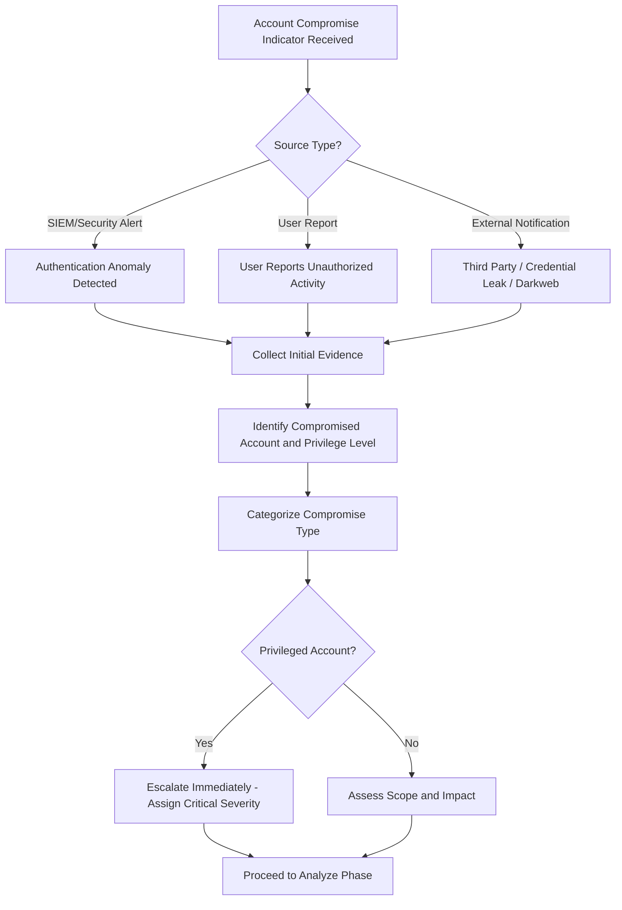
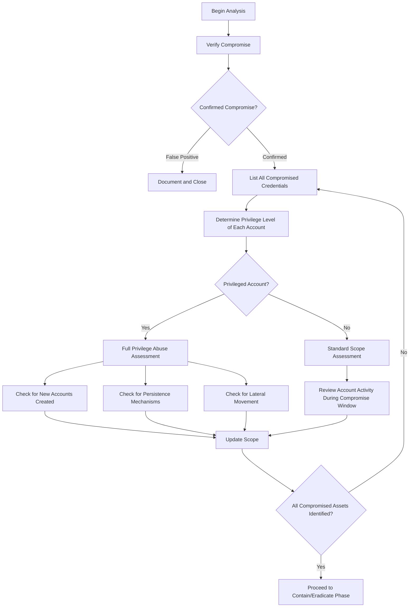
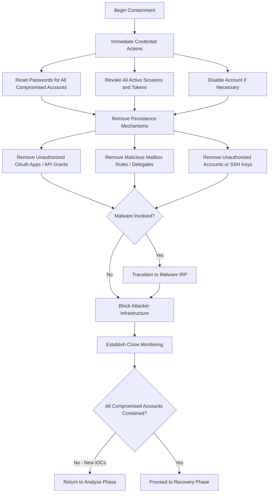
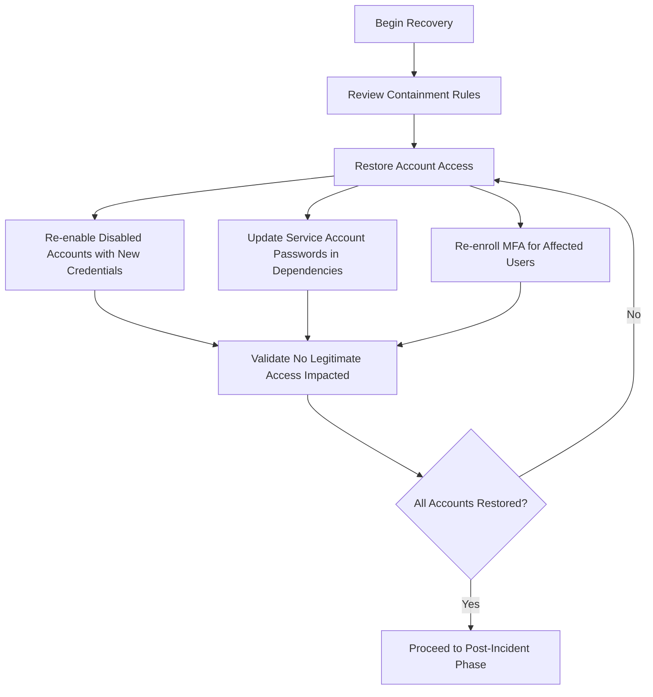
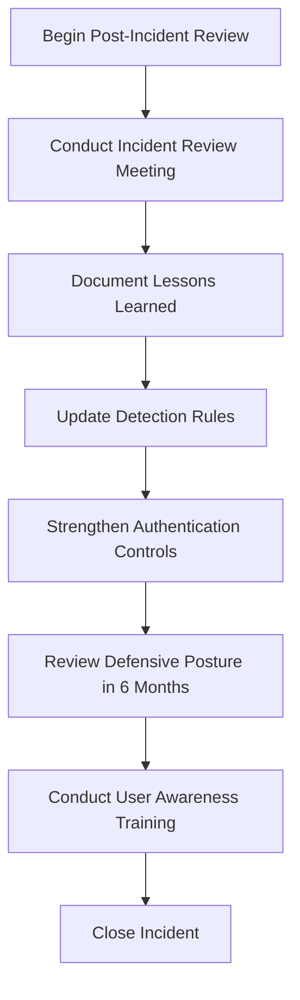

# Account Compromise Incident Response Playbook

| Field | Details |
|-------|---------|
| **Playbook ID** | IRP-ACCTCOMP-001 |
| **Version** | 2.0 |
| **Last Updated** | February 2025 |
| **Incident Category** | Account Compromise / Unauthorized Access |
| **MITRE ATT&CK Tactics** | Credential Access (TA0006), Persistence (TA0003), Privilege Escalation (TA0004), Lateral Movement (TA0008) |
| **Applicable Techniques** | Valid Accounts (T1078), Brute Force (T1110), MFA Fatigue (T1621), Unsecured Credentials (T1552), Steal Web Session Cookie (T1539) |
| **Severity Range** | Medium to Critical (based on account privilege level) |
| **Target Audience** | L2/L3 Analysts, Incident Managers, SOC Leads |
| **Related Playbooks** | [Phishing IRP](IRP-Phishing.md), [Malware IRP](IRP-Malware.md), [Data Loss IRP](IRP-DataLoss.md) |

---

## Scope

This playbook covers the end-to-end incident response process for account compromise incidents, including:

- **Credential Theft** — Accounts compromised through phishing, keylogging, credential stuffing, or password spraying attacks
- **Brute Force / Password Guessing** — Unauthorized access achieved through automated or manual password guessing
- **MFA Bypass** — Accounts compromised through MFA fatigue, SIM swapping, or session token theft
- **Session Hijacking** — Unauthorized use of stolen session tokens, cookies, or OAuth tokens
- **Insider Account Misuse** — Authorized users exceeding their access privileges or sharing credentials
- **Service Account Compromise** — Automated or service accounts leveraged for unauthorized actions
- **Cloud Account Takeover** — Compromise of Azure AD, O365, AWS, or other cloud identity accounts

**Out of Scope:** This playbook does not cover initial phishing delivery (see [Phishing IRP](IRP-Phishing.md)) or malware-based credential harvesting from endpoint memory (see [Malware IRP](IRP-Malware.md)). However, account compromise is frequently a consequence of phishing or malware, and this playbook should be run in parallel when applicable.

---

## 1. Preparation

### 1.1 Organizational Readiness

- Maintain an inventory of all privileged accounts (domain admins, service accounts, cloud admins, database admins) with documented ownership and authorization levels.
- Ensure multi-factor authentication (MFA) is enforced on all accounts, particularly privileged and externally accessible accounts.
- Implement and maintain a baseline of normal authentication behavior per user (typical login times, locations, devices) where possible.
- Define Conditional Access policies or equivalent controls for cloud environments.
- Establish a process for emergency credential rotation, including service accounts and shared credentials.
- Define threat and risk indicators and alerting patterns within the SIEM for authentication anomalies.
- Identify and obtain the services of a third-party cyber forensic provider if internal capabilities are insufficient.

### 1.2 Communication Templates

Prepare the following templates in advance:

- **Internal notification** — Alert employees about credential compromise impacting the organization, instructing immediate password changes if applicable.
- **Account lockout notification** — Inform affected users that their account has been temporarily locked or reset as a precautionary measure.
- **Third-party notification** — Contact cloud providers, SaaS vendors, or partner organizations if their accounts or integrations are affected.
- **Regulatory notification** — Template for notifying regulatory bodies if compromised accounts had access to regulated data (GDPR, HIPAA, PCI-DSS).

### 1.3 Tool Access

| Tool Category | Purpose | Examples |
|---------------|---------|----------|
| SIEM Platform | Authentication log search, correlation | Splunk, Sentinel, QRadar |
| Identity Platform | Account management, session revocation | Azure AD, Active Directory, Okta |
| EDR Platform | Endpoint investigation for credential theft | CrowdStrike, SentinelOne, Defender for Endpoint |
| Cloud Admin Console | Cloud account audit, OAuth app review | Azure Portal, AWS Console, Google Workspace Admin |
| Threat Intelligence | IOC validation, credential leak monitoring | VirusTotal, Have I Been Pwned, Recorded Future |
| Network Monitoring | Lateral movement detection | Firewall logs, DNS logs, NetFlow data |

### 1.4 Asset and Contact Information

- Privileged account inventory with ownership, authorization level, and business criticality
- Service account documentation including dependencies and application mappings
- Active Directory architecture including trust relationships, forests, and domain structure
- Cloud identity architecture including federation, synchronization, and conditional access configurations
- Internal escalation paths for identity and access management (IAM) teams

### 1.5 Training and Exercises

- Conduct regular security awareness training covering password hygiene, MFA importance, and recognizing credential theft attempts.
- Perform tabletop exercises simulating account compromise scenarios at least once per year.
- Review threat intelligence regularly for credential leak databases, access broker activity, and authentication bypass techniques.

---

## 2. Detection

### 2.1 Workflow

### 2.2 Threat Indicator Sources

**Internal Alerts:**
- SIEM correlation rules detecting brute force attempts, impossible travel, or anomalous login patterns
- Azure AD / Identity Protection alerts for risky sign-ins or risky users
- EDR alerts for credential dumping tools (Mimikatz, LaZagne, etc.) or LSASS access
- DLP alerts for unauthorized data access from compromised accounts
- Helpdesk tickets from users reporting account lockouts or unexpected MFA prompts

**External Notifications:**
- Credential leak monitoring services detecting company emails in breached databases
- Third-party organizations reporting unauthorized activity originating from company accounts
- Cloud provider security alerts for unusual account behavior
- Darkweb monitoring identifying company credentials for sale

### 2.3 Risk Factors

**Common Risks:**
- Lateral movement using compromised credentials to access additional systems
- Privilege escalation from standard user to domain admin or cloud admin
- Data exfiltration using authorized account access to bypass security controls
- Persistence through creation of backdoor accounts, OAuth applications, or mailbox forwarding rules
- Financial fraud through BEC using compromised executive accounts

**Organizational Risks:**
- Regulatory penalties if compromised accounts had access to PII, PHI, or financial data
- Reputational damage if customer-facing accounts or systems are compromised
- Supply chain risk if partner or vendor integration accounts are compromised
- Operational disruption if service accounts critical to business operations are reset

### 2.4 Data Collection

**Account Details:**
- Account name, type (standard user, service account, admin, shared)
- Account privilege level and group memberships
- MFA configuration and enrollment status
- Last known legitimate login (time, location, device)

**Compromise Indicators:**
- Source IP addresses of suspicious logins
- Geolocation of authentication events
- User agent strings and device information
- Timestamps of unauthorized activity
- Failed authentication attempts preceding the compromise

### 2.5 Categorization

| Category | Description | Typical Indicators |
|----------|-------------|--------------------|
| **Brute Force** | Password guessed through repeated attempts | High volume of failed logins followed by success |
| **Credential Stuffing** | Leaked credentials reused from other breaches | Login from unusual location with valid credentials, no prior failures |
| **Phishing-Based** | Credentials harvested via phishing page | Preceding phishing email, login from attacker IP shortly after |
| **MFA Fatigue** | Repeated MFA push until user approves | Burst of MFA requests, approval from unusual location |
| **Session Hijack** | Stolen session token or cookie reused | Activity from new IP without authentication event |
| **Insider Misuse** | Authorized user exceeding privileges | Access to unusual resources, off-hours activity, bulk downloads |
| **Service Account** | Automated account used for unauthorized actions | Unexpected processes, unusual API calls, lateral movement |

### 2.6 Severity Assessment

| Severity | Criteria |
|----------|----------|
| **Critical** | Domain admin / global admin compromised, service account with broad access, confirmed lateral movement, or active attacker presence |
| **High** | Privileged account compromised, multiple accounts affected, confirmed unauthorized data access |
| **Medium** | Standard user account compromised with confirmed unauthorized login, limited data access |
| **Low** | Failed brute force without successful login, credential leak detected but no evidence of exploitation |

---

## 3. Analyze

### 3.1 Workflow

### 3.2 Verification

- Review authentication logs to confirm unauthorized access occurred (not just failed attempts).
- Correlate with known user behavior — check with the user or their manager whether the activity was legitimate.
- Rule out false positives caused by VPN changes, travel, new devices, or automated processes.
- For credential leak notifications, verify if the leaked password is still current.

### 3.3 Compromised Credential Inventory

- List every account confirmed or suspected to be compromised.
- For each account, document: account name, type, privilege level, group memberships, and systems accessible.
- Identify any machines where the compromised account has logged in (treat these as potentially compromised).
- Check for compromised domains if the account has cross-domain trust access.

### 3.4 Privilege and Access Assessment

- What systems, applications, and data stores can this account access?
- Does the account have administrative privileges on any systems?
- Does the account have access to credential stores (password vaults, key management)?
- Are there any service accounts or applications that use the same credentials?
- Does the account have cloud admin roles (Azure AD Global Admin, AWS IAM Admin)?

### 3.5 Persistence and Lateral Movement Assessment

**Persistence Mechanisms to Check:**
- New user accounts or service principals created during the compromise window
- New OAuth application grants or API permissions added
- Mailbox forwarding rules or delegates added
- Scheduled tasks or startup scripts modified
- SSH keys or certificates added
- Conditional Access exclusions modified

**Lateral Movement Indicators:**
- Authentication events from the compromised account to other systems
- RDP, SMB, WinRM, or SSH connections to other hosts
- Use of administrative tools (PsExec, WMI, PowerShell remoting) from unexpected sources
- New service installations or scheduled tasks on remote systems
- Access to file shares, databases, or cloud resources not typically accessed

### 3.6 Scope Validation

Before proceeding to containment, confirm:

- All compromised accounts have been identified
- All systems where compromised accounts authenticated have been documented
- All persistence mechanisms have been identified
- All data accessed during the compromise window has been cataloged
- The initial access vector has been identified (phishing, credential leak, brute force, etc.)

If new compromised accounts or IOCs are discovered, loop back to Section 3.3.

---

## 4. Contain and Eradicate

### 4.1 Workflow

### 4.2 Immediate Credential Actions

**Password Reset:**
- Reset passwords for all confirmed compromised accounts immediately.
- For domain admin compromise, reset the KRBTGT password twice (with a minimum 10-hour gap between resets to allow replication).
- Reset passwords for any accounts that share or reuse the compromised password.
- For service accounts, coordinate with application owners before resetting to avoid service disruption.

**Session and Token Revocation:**
- Revoke all active sessions for compromised accounts.
- Revoke all OAuth tokens and refresh tokens.
- Invalidate any API keys or access tokens associated with the compromised account.
- Force re-authentication on all devices.

**Account Lockout (if necessary):**
- If the attacker is actively using the account, disable the account immediately.
- Document the business impact and communicate to affected stakeholders.

### 4.3 Persistence Removal

- Delete unauthorized user accounts or service principals created during the compromise window.
- Remove unauthorized OAuth application consents and API permission grants.
- Remove malicious mailbox rules (forwarding, redirect, delete rules) and mail delegates.
- Remove unauthorized SSH keys, certificates, or trusted devices.
- Revert any Conditional Access policy changes made during the compromise.
- Check and remove unauthorized MFA methods enrolled on the account.

### 4.4 Malware Assessment

If the compromise involved malware on endpoints:

- Transition to the [Malware IRP](IRP-Malware.md) for endpoint containment and remediation.
- Check for credential dumping tools (Mimikatz, LaZagne, ProcDump targeting LSASS).
- If credential dumping is confirmed, treat ALL accounts that authenticated on the compromised host as potentially compromised.

### 4.5 Network Containment

- Add attacker source IPs to firewall deny rules.
- Block attacker domains at DNS and web proxy level.
- If lateral movement is confirmed, consider network segmentation or isolation of affected segments.
- For domain-level compromise, consider disabling trust relationships with other domains until containment is complete.

### 4.6 Close Monitoring

- Monitor for new authentication attempts from attacker IP addresses.
- Monitor compromised accounts for unauthorized activity post-reset.
- Monitor for new persistence mechanisms being created.
- Monitor for connections to attacker infrastructure from any internal system.
- Alert on any new accounts created or privilege changes during the monitoring period.

---

## 5. Recovery

### 5.1 Workflow

### 5.2 Defense Updates

- Evaluate firewall rules, proxy blocks, and DNS sinkhole entries for attacker infrastructure.
- Determine whether emergency account disablements can be reversed.
- Assess whether Conditional Access policies need permanent strengthening.
- Evaluate need for additional authentication controls (passwordless, hardware security keys).

### 5.3 Account Restoration

- Re-enable accounts that were disabled during containment.
- Ensure users set new, strong passwords and re-enroll MFA.
- Update service account passwords in all dependent applications and scripts.
- Verify application integrations using service accounts are functioning correctly.
- Confirm no unauthorized mailbox rules, OAuth grants, or MFA enrollments persist.

### 5.4 Endpoint Recovery

If endpoints were compromised:

- Follow recovery procedures in the [Malware IRP](IRP-Malware.md).
- Ensure credential caches are cleared on recovered endpoints.
- Verify local accounts on recovered systems have been reset.

---

## 6. Post-Incident

### 6.1 Workflow

### 6.2 Incident Review

Document what worked, what did not, and specific improvements for identity controls, monitoring, and procedures.

### 6.3 Detection Rule Updates

- SIEM — Refine authentication anomaly rules based on the observed attack pattern.
- Identity Protection — Update risk policies and Conditional Access rules.
- EDR — Add behavioral detections for credential theft tools.
- Cloud security — Update alerts for OAuth grants, mailbox rule changes, and privilege escalations.

### 6.4 Authentication Control Improvements

- Enforce MFA on all accounts, prioritizing hardware keys for privileged accounts.
- Implement Conditional Access restricting auth to managed devices and trusted locations for sensitive accounts.
- Review password policies and implement password leak detection.
- Evaluate privileged access management (PAM) for just-in-time access.
- Eliminate shared passwords for service accounts; implement managed service accounts where possible.

### 6.5 Defensive Posture Review

- Schedule review of all rules introduced during this incident in 6 months.
- Assess continued applicability of firewall rules, proxy blocks, and account restrictions.

### 6.6 User Awareness Training

Provide training covering password security, password reuse risks, recognizing MFA fatigue attacks, reporting unauthorized account activity immediately, and the importance of never sharing credentials.

---

## References

- [NIST SP 800-61 Rev. 2 — Computer Security Incident Handling Guide](https://nvlpubs.nist.gov/nistpubs/SpecialPublications/NIST.SP.800-61r2.pdf)
- [CERT Société Générale — Incident Response Methodologies](https://github.com/certsocietegenerale/IRM/tree/master/EN)
- [MITRE ATT&CK — Valid Accounts (T1078)](https://attack.mitre.org/techniques/T1078/)
- [MITRE ATT&CK — Brute Force (T1110)](https://attack.mitre.org/techniques/T1110/)
- [Microsoft — Compromised Account Investigation](https://learn.microsoft.com/en-us/security/operations/incident-response-playbook-compromised-malicious-app)
