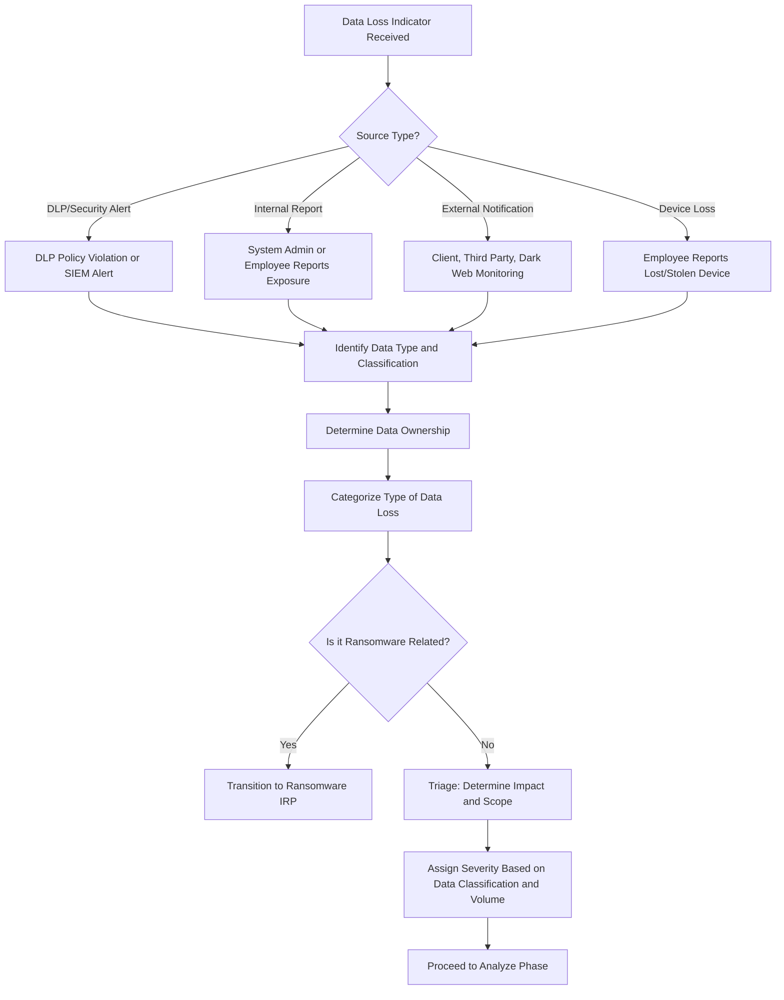
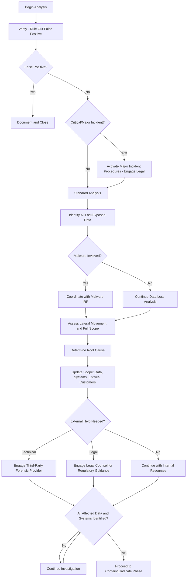
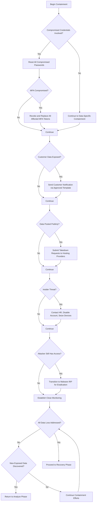
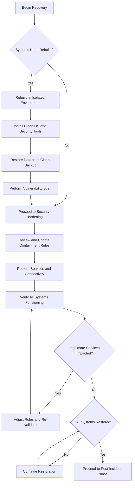
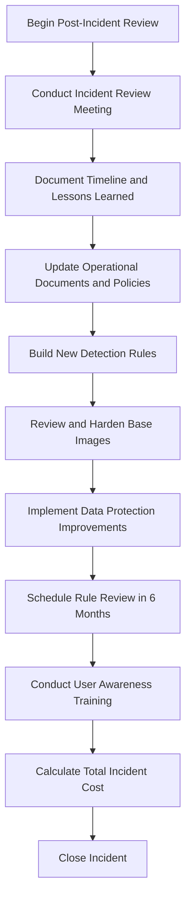

# Data Loss Incident Response Playbook

| Field | Details |
|-------|---------|
| **Playbook ID** | IRP-DATA-001 |
| **Version** | 2.0 |
| **Last Updated** | February 2025 |
| **Incident Category** | Data Loss / Data Breach / Data Exfiltration |
| **MITRE ATT&CK Tactics** | Exfiltration (TA0010), Collection (TA0009), Impact (TA0040) |
| **Applicable Techniques** | Exfiltration Over C2 Channel (T1041), Exfiltration Over Web Service (T1567), Data Staged (T1074), Data from Information Repositories (T1213), Automated Collection (T1119) |
| **Severity Range** | Medium to Critical (based on data classification and volume) |
| **Target Audience** | L2/L3 Analysts, Incident Managers, SOC Leads, Legal, DPO |
| **Related Playbooks** | [Malware IRP](IRP-Malware.md), [Account Compromise IRP](IRP-AccountCompromised.md), [Ransomware IRP](IRP-Ransom.md), [Phishing IRP](IRP-Phishing.md) |

---

## Scope

This playbook covers the end-to-end incident response process for data loss and data breach incidents, including:

- **Cyber Threat Exfiltration** — Data stolen by external threat actors through malware, compromised accounts, or exploitation of vulnerabilities
- **Insider Threat** — Intentional data theft or unauthorized disclosure by current or former employees, contractors, or partners
- **Accidental Data Exposure** — Unintentional disclosure through misconfigured systems, misdirected emails, or publicly accessible storage
- **Device Loss or Theft** — Loss of laptops, phones, USB drives, or other devices containing sensitive data
- **Cloud Data Exposure** — Misconfigured cloud storage (S3 buckets, Azure Blob, SharePoint) exposing data publicly or to unauthorized parties
- **Ransomware-Related Data Theft** — Data exfiltration as part of a double extortion ransomware attack
- **Physical Document Loss** — Loss or theft of printed documents containing sensitive information

**Out of Scope:** If data loss is part of a ransomware attack, begin with the [Ransomware IRP](IRP-Ransom.md) and coordinate with this playbook for the data loss aspects. If data loss resulted from malware, run this playbook in parallel with the [Malware IRP](IRP-Malware.md). If data loss resulted from an account compromise, run in parallel with the [Account Compromise IRP](IRP-AccountCompromised.md).

---

## 1. Preparation

### 1.1 Organizational Readiness

- Implement a data classification policy that categorizes data by sensitivity (Public, Internal, Confidential, Restricted/Regulated).
- Deploy Data Loss Prevention (DLP) controls across email, endpoints, and cloud services.
- Maintain an inventory of sensitive data repositories (databases, file shares, cloud storage, SaaS applications) with data owners and data classification.
- Ensure encryption is enforced on all endpoints (full-disk encryption) and mobile devices.
- Ensure encryption is enforced for data in transit (TLS) and at rest for sensitive data stores.
- Establish legal and regulatory compliance requirements for data breach notification (GDPR 72-hour notification, HIPAA, PCI-DSS, state breach notification laws).
- Identify the Data Protection Officer (DPO) or equivalent role and ensure they are part of the incident response escalation path.
- Retain legal counsel with data breach experience (external counsel may be preferred for privilege considerations).
- Identify and retain a third-party forensic provider for evidence preservation and investigation.
- Maintain a dark web monitoring service to detect organizational data appearing on underground forums or marketplaces.

### 1.2 Communication Templates

- **Internal notification** — Alert the security team, IT, Legal, and management about a confirmed or suspected data loss incident.
- **Customer breach notification** — Notify affected customers about the data breach, what data was exposed, and what actions they should take (must comply with regulatory requirements).
- **Regulatory breach notification** — Template for mandatory notifications to data protection authorities (ICO, CNIL, state AG offices) with required content and within required timeframes.
- **Law enforcement notification** — Template for reporting to relevant law enforcement agencies.
- **Hosting/Platform takedown** — Request removal of exposed data from third-party platforms, paste sites, or hosting providers.
- **Employee communication** — If insider threat is involved, coordination template for HR, Legal, and Physical Security.

### 1.3 Tool Access

| Tool Category | Purpose | Examples |
|---------------|---------|----------|
| SIEM Platform | Log search, data movement analysis | Splunk, Sentinel, QRadar |
| DLP Solution | Data loss detection, policy alerts | Microsoft Purview, Symantec DLP, Forcepoint |
| EDR Platform | Endpoint investigation, file activity tracking | CrowdStrike, SentinelOne, Defender for Endpoint |
| CASB/Cloud Security | Cloud application monitoring, sharing detection | Microsoft Defender for Cloud Apps, Netskope |
| Network Security | Network traffic analysis, exfiltration detection | Firewall logs, IDS/IPS, Proxy logs, NetFlow |
| Threat Intelligence | Dark web monitoring, breach detection | Recorded Future, SpyCloud, Digital Shadows |
| eDiscovery | Data identification and preservation | Microsoft Purview eDiscovery, Relativity |

### 1.4 Asset and Contact Information

- Data classification inventory with data owners and custodians
- Regulatory requirements matrix (which data types trigger which notification requirements)
- Data Protection Officer (DPO) or Privacy Officer contact information
- Legal counsel contact (internal and external)
- HR leadership contact (for insider threat scenarios)
- Physical Security team contact (for device theft or insider threat involving physical actions)
- Cyber insurance carrier contact and policy details
- Law enforcement contacts for the relevant jurisdictions
- Contact information for major platform abuse teams (Google, Microsoft, GitHub, Pastebin)

### 1.5 Training and Exercises

- Conduct data handling awareness training for all employees, covering data classification, acceptable use, and reporting suspected data loss.
- Perform tabletop exercises specifically focused on data breach scenarios, including regulatory notification timelines and decision-making processes, at least once per year.
- Ensure incident response team members understand regulatory notification requirements and the critical importance of evidence preservation for potential legal proceedings.

---

## 2. Detection

### 2.1 Workflow

### 2.2 Threat Indicator Sources

**Internal Alerts:**
- DLP policy violation alerts for sensitive data leaving the organization (email, USB, cloud upload, print)
- SIEM alerts for unusual data transfer volumes or patterns (large outbound transfers, off-hours activity)
- CASB alerts for unauthorized cloud application data uploads or excessive file sharing
- EDR alerts for data staging tools (archiving, compression of large data sets)
- Proxy alerts for uploads to cloud storage, file sharing, or paste sites
- Database activity monitoring alerts for bulk data queries or exports

**Internal Reports:**
- System administrators discovering misconfigured storage or publicly accessible databases
- Employees reporting misdirected emails or documents sent to wrong recipients
- Employees reporting lost or stolen devices (laptops, phones, USB drives)
- Employees reporting suspicious colleague behavior related to data access

**External Notifications:**
- Customers or partners reporting that their data has been exposed or received by unauthorized parties
- Dark web monitoring services detecting organizational data on underground forums or marketplaces
- Threat actors claiming to possess organizational data and demanding payment
- Security researchers or journalists contacting the organization about discovered data exposure
- Regulatory authorities notifying the organization about a reported breach
- Law enforcement notifications

### 2.3 Risk Factors

**Common Risks:**
- Exposure of personally identifiable information (PII) triggering regulatory notification requirements
- Exposure of intellectual property or trade secrets to competitors or public
- Financial fraud enabled by exposure of financial data, credentials, or authentication tokens
- Identity theft risk for individuals whose personal data was exposed
- Loss of competitive advantage through exposure of business strategies, pricing, or customer data

**Organizational Risks:**
- Regulatory fines and penalties (GDPR fines up to 4% of global annual revenue, HIPAA fines, PCI-DSS penalties)
- Legal liability and class-action lawsuits from affected individuals
- Customer trust erosion and contract termination
- Reputational damage from public disclosure
- Financial losses from incident response costs, credit monitoring services, and legal fees
- Contract penalties for failure to meet data protection obligations

### 2.4 Data Collection

**Data Characterization:**
- Type of data exposed (PII, PHI, financial, intellectual property, credentials, MFA tokens)
- Data classification level (Public, Internal, Confidential, Restricted/Regulated)
- Age of the data (current, historical, archived)
- Data owner (organization, customer, partner)
- Volume of data (number of records, number of documents, data size)
- Whether the data was encrypted at rest or in transit when exposed

**Exposure Details:**
- How was the data exposed or lost? (exfiltration, misconfiguration, device loss, misdirected email, insider theft)
- When did the exposure occur? (date/time of data loss or discovery)
- Where was the data exposed to? (attacker infrastructure, public internet, specific recipient, dark web)
- Who had access to the exposed data? (specific threat actor, public, limited recipients)
- Is the data still accessible or has it been contained?

### 2.5 Categorization

| Category | Description | Key Considerations |
|----------|-------------|--------------------|
| **Cyber Threat Exfiltration** | Data stolen by external attackers | Coordinate with Malware/Account Compromise IRP; likely ongoing access |
| **Insider Threat (Malicious)** | Intentional data theft by employee/contractor | Involve HR and Legal immediately; preserve evidence for potential prosecution |
| **Insider Threat (Negligent)** | Accidental exposure through carelessness | Focus on remediation and training; assess if systemic process failure |
| **Misdirected Communication** | Email or document sent to wrong recipient | Assess if recipient can be trusted; request deletion; determine regulatory impact |
| **Device Loss/Theft** | Physical device with data lost or stolen | Determine encryption status; remote wipe capability; data on device |
| **Cloud Misconfiguration** | Storage or application publicly accessible | Determine exposure duration; assess if data was actually accessed |
| **Ransomware Data Theft** | Data stolen as part of double extortion | Transition to Ransomware IRP; anticipate public disclosure threat |
| **Physical Document Loss** | Printed sensitive documents lost or stolen | Assess content and distribution; limited technical remediation options |

### 2.6 Triage and Severity Assessment

**Scope Assessment:**
- How many records or documents are affected?
- How many individuals (employees, customers, partners) are affected?
- How many business entities or clients are affected?
- What is the data classification of the exposed data?
- Is the exposure ongoing or contained?

**Severity Matrix:**

| Severity | Criteria |
|----------|----------|
| **Critical** | Regulated data (PII/PHI) of 10,000+ individuals exposed; data posted publicly or sold on dark web; ongoing exfiltration of classified data; encryption keys or master credentials exposed |
| **High** | Regulated data of 100-10,000 individuals; intellectual property or trade secrets exposed; customer data breach triggering notification requirements; insider threat with confirmed malicious intent |
| **Medium** | Internal confidential data exposed to limited recipients; device loss with full-disk encryption enabled; misdirected email with sensitive content to known, trusted recipient |
| **Low** | Non-sensitive internal data exposed; data exposure contained before external access confirmed; test/development data with no real PII |

---

## 3. Analyze

### 3.1 Workflow

### 3.2 Verification

Before committing resources to full investigation, verify the alert:

- Confirm with a senior analyst that the data loss indicator is not a false positive (legitimate business data transfer, authorized cloud sharing, approved data export).
- Verify the data classification of the affected data — this determines the severity and regulatory requirements.
- Confirm the data owner and notify them of the suspected exposure.

### 3.3 Data Exposure Assessment

Document the complete scope of data exposure:

- Catalog all files, documents, and records that were lost or exposed.
- Determine if credentials, MFA tokens, API keys, or encryption keys were included in the exposed data.
- Identify all PII elements exposed (names, addresses, social security numbers, financial accounts, health records).
- Determine the total number of affected individuals (employees, customers, partners).
- Assess whether the exposed data is sufficient for identity theft, financial fraud, or competitive harm.

### 3.4 Access and Movement Analysis

Determine the full scope of unauthorized access:

- Trace all systems and data repositories accessed by the threat actor or insider.
- Review firewall logs and NetFlow data for unusual data transfers to external destinations.
- Review proxy logs for uploads to cloud storage, file sharing services, or paste sites.
- Assess the number of endpoints and servers involved.
- Determine if lateral movement occurred, expanding the scope beyond the initial exposure.
- For each affected customer, perform the same scope assessment.

### 3.5 Root Cause Analysis

Identify how the data loss occurred:

| Root Cause | Investigation Focus |
|------------|-------------------|
| **Phishing** | Email logs, user activity after clicking link, credential usage |
| **Vulnerability Exploitation** | System logs, patch status, exploitation artifacts |
| **Weak/Default Credentials** | Authentication logs, brute force patterns, credential reuse |
| **Insider Threat** | DLP logs, file access logs, USB usage, email patterns, cloud upload activity |
| **Cloud Misconfiguration** | Cloud service configuration audit, access logs, public accessibility checks |
| **Device Loss** | Device inventory, encryption status, remote wipe capability, last known location |
| **Human Error** | Email logs, document sharing history, process failures |

### 3.6 External Assistance Assessment

**Technical Assistance:**
- If the investigation requires forensic capabilities beyond the internal team's capacity, engage the retained third-party forensic provider.
- Complex data exfiltration through encrypted channels, memory forensics, or advanced persistent threat analysis may require specialist support.

**Legal Assistance:**
- If the exposed data includes regulated information (PII under GDPR, PHI under HIPAA, cardholder data under PCI-DSS), engage legal counsel immediately.
- Legal counsel should advise on notification requirements, timelines, and regulatory obligations.
- Consider whether attorney-client privilege should be applied to the investigation (external counsel directing the investigation).

### 3.7 Scope Validation

Before proceeding to containment, confirm:

- All lost/exposed data has been identified and cataloged.
- All affected endpoints, systems, and data repositories have been identified.
- All affected business entities and customers have been identified.
- The root cause has been determined.
- If applicable, all IOCs (URLs, domains, IPs, file hashes) have been fully investigated.
- Regulatory notification requirements and timelines have been identified.

---

## 4. Contain and Eradicate

### 4.1 Workflow

### 4.2 Credential Containment

If any credentials were compromised as part of the data loss:

- Reset all compromised passwords immediately (local, network, cloud, remote access).
- Revoke all active sessions and tokens for affected accounts.
- If MFA tokens or codes were compromised, revoke and replace all affected MFA methods.
- Force re-enrollment of MFA for affected users through a verified secure process.
- Coordinate with the [Account Compromise IRP](IRP-AccountCompromised.md) for comprehensive credential remediation.

### 4.3 Customer Data Notification

If customer data was exposed:

- Notify all affected customers using the approved customer communication template.
- Follow regulatory notification timelines strictly (GDPR: 72 hours to supervisory authority, "without undue delay" to affected individuals).
- Provide clear information about what data was exposed, what risks exist, and what actions customers should take.
- Offer credit monitoring or identity protection services if PII was exposed (coordinate with Legal for scope and duration).

### 4.4 Data Takedown

If data has been posted to the internet or third-party platforms:

- Submit abuse/takedown requests to hosting providers, platform operators, and paste sites.
- Contact major search engines to request de-indexing of exposed data pages.
- Monitor for the data reappearing on other platforms after takedown.
- Document all takedown requests and responses for legal proceedings.

### 4.5 Insider Threat Response

If the data loss was caused by an intentional insider threat:

- Contact HR immediately — do not confront the employee directly.
- Disable the employee's user account and VPN access.
- Revoke all MFA tokens and application access.
- Coordinate with Physical Security to seize the employee's laptop, phone, and any other company devices.
- Preserve all evidence (email logs, file access logs, DLP alerts, USB usage logs) for potential legal proceedings.
- Legal counsel should advise on employment law implications and potential criminal referral.

### 4.6 Continued Access Containment

If the threat actor still has access to the environment:

- Transition to the [Malware IRP](IRP-Malware.md) for technical eradication of the attacker's access.
- Block all identified C2 infrastructure and exfiltration channels.
- Isolate affected endpoints and servers.

### 4.7 Close Monitoring

Establish monitoring for the duration of the incident:

- Monitor for additional data exfiltration attempts.
- Monitor for new communications from the attacker (ransom demands, threats to publish).
- Monitor dark web and paste sites for the organization's data.
- Monitor for people attempting to return lost devices or documents.
- Monitor for the exposed data being used (fraudulent transactions, identity theft reports from affected individuals).

---

## 5. Recovery

### 5.1 Workflow

### 5.2 System Rebuild

For systems that require rebuild (compromised by malware or untrusted after attacker access):

- Rebuild in an isolated environment with a clean OS, current patches, and security tools.
- Restore data only from backups verified to be clean.
- Perform vulnerability scanning before connecting to production.

### 5.3 Security Hardening

Based on the root cause, implement targeted hardening:

- If caused by misconfiguration, audit and harden all similar configurations across the environment.
- If caused by missing patches, implement emergency patching and review patch management processes.
- If caused by weak access controls, implement least-privilege access and review all data access permissions.
- If caused by missing DLP controls, implement or expand DLP policies to cover the identified gap.
- If caused by device loss, review and enforce device encryption and remote wipe capabilities.

### 5.4 Defense Updates

Review all containment rules and determine their long-term status:

- Firewall rules for blocking exfiltration channels
- DLP policies for preventing similar data loss
- EDR hash bans and behavioral rules
- Proxy blocks for exfiltration destinations
- DNS sinkhole entries
- Cloud security configurations

For each rule, decide whether it should be made permanent, kept temporarily with a review date, or removed. Document the decision and rationale.

### 5.5 Service Restoration

- Lift containment on restored endpoints.
- Re-enable network connectivity for rebuilt systems.
- Verify all business-critical applications and data access are functioning.
- Confirm no legitimate services are impacted by remaining containment rules.

---

## 6. Post-Incident

### 6.1 Workflow

### 6.2 Incident Review

Conduct a comprehensive post-incident review with Security, IT, Legal, Privacy/DPO, and management. Document:

- **Complete timeline** from initial data exposure through detection, containment, and recovery
- **What worked well** — Which controls detected the data loss? How effective were containment actions?
- **What did not work** — Where did existing DLP, access controls, or monitoring fail to prevent or detect the loss?
- **Regulatory response assessment** — Were notification timelines met? Was the communication effective?
- **Improvement priorities** — Ranked list of data protection improvements

### 6.3 Detection and Policy Updates

- Build new SIEM detection rules for the data movement patterns observed during the incident.
- Update DLP policies to address the specific exfiltration channel or data type that was missed.
- Update email gateway rules if data left via email.
- Update proxy and firewall rules for identified exfiltration destinations.
- Update cloud security configurations (CASB policies, sharing restrictions).
- Review and update data classification policies if the affected data was incorrectly classified.

### 6.4 Infrastructure Hardening

- Review and harden base images if the incident was facilitated by missing security controls.
- Review data access permissions and implement least-privilege access where gaps are identified.
- Review cloud storage and application configurations for publicly accessible data.
- Review and strengthen endpoint encryption policies.
- Implement or improve USB device control policies.
- Review and improve network segmentation to limit data access scope.

### 6.5 User Awareness Training

If the data loss was caused by human error or social engineering:

- Provide targeted training on data handling, classification, and the specific scenario that led to the loss.
- Reinforce the policy for reporting suspected data loss immediately.
- For insider threat scenarios, conduct organization-wide training on data handling policies and consequences of policy violations.

### 6.6 Incident Cost Calculation

Document the total cost of the incident:

- Staff time across detection, investigation, containment, and recovery
- Legal and consulting fees (external counsel, forensic provider)
- Regulatory fines and penalties
- Credit monitoring or identity protection services for affected individuals
- Customer notification costs (mailings, call center support)
- Operational downtime and productivity loss
- Customer churn and contract penalties
- Reputational damage (estimated)
- Cyber insurance deductible and coverage

---

## References

This playbook was developed using the following frameworks and resources:

- [NIST SP 800-61 Rev. 2 — Computer Security Incident Handling Guide](https://nvlpubs.nist.gov/nistpubs/SpecialPublications/NIST.SP.800-61r2.pdf)
- [CERT Société Générale — Incident Response Methodologies](https://github.com/certsocietegenerale/IRM/tree/master/EN)
- [IncidentResponse.com — Data Breach Playbook](https://www.incidentresponse.com/playbooks/)
- [Scottish Government — Cyber Resilience Incident Management](https://www.gov.scot/publications/cyber-resilience-incident-management/)
- [MITRE ATT&CK — Exfiltration Tactic (TA0010)](https://attack.mitre.org/tactics/TA0010/)
- [GDPR Article 33 — Notification of Personal Data Breach](https://gdpr-info.eu/art-33-gdpr/)
- [NIST SP 800-122 — Guide to Protecting PII](https://nvlpubs.nist.gov/nistpubs/Legacy/SP/nistspecialpublication800-122.pdf)
