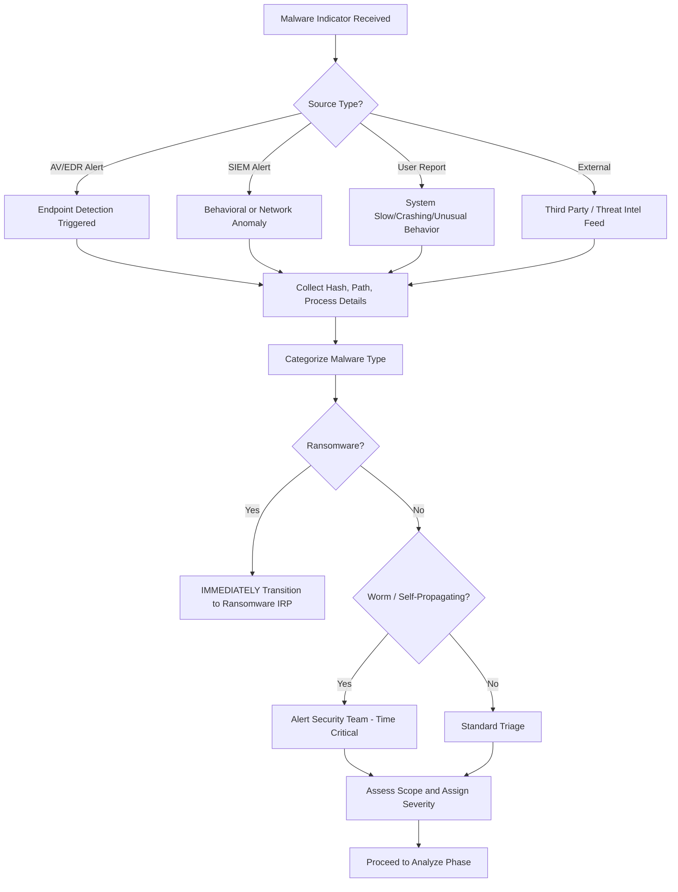
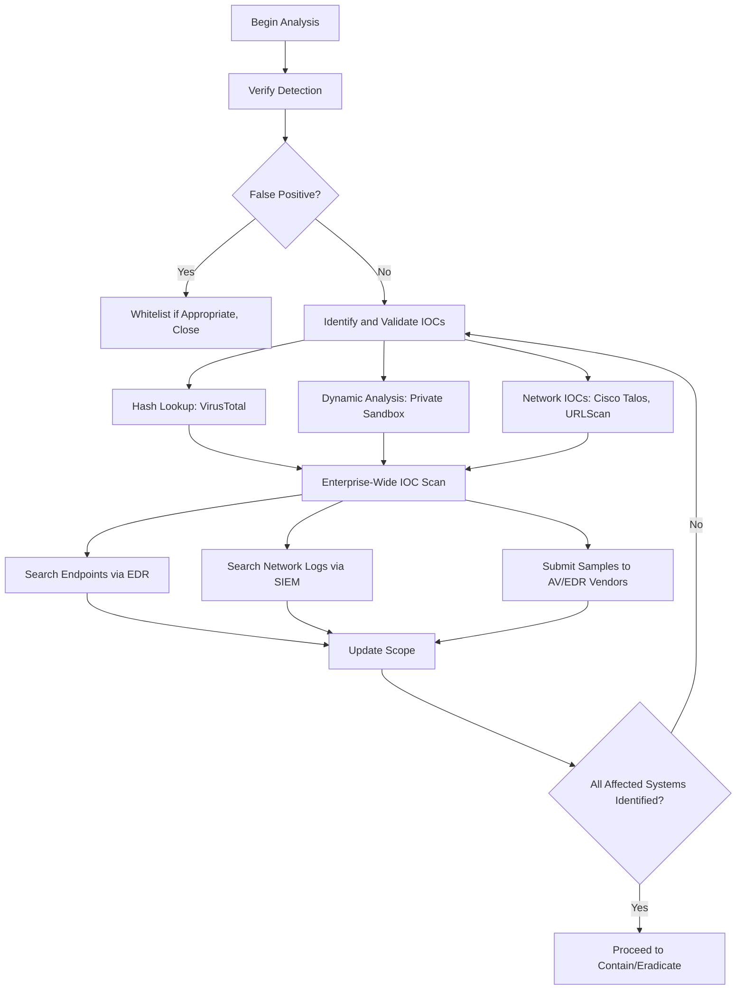
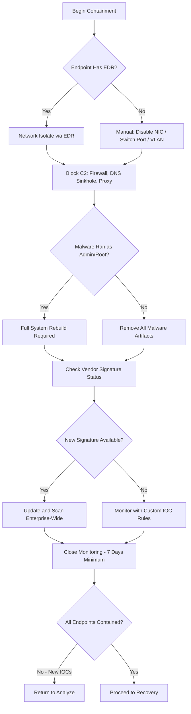
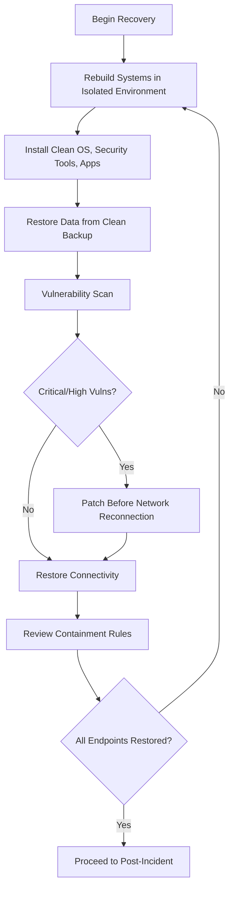

# Malware Incident Response Playbook

| Field | Details |
|-------|---------|
| **Playbook ID** | IRP-MALWARE-001 |
| **Version** | 2.0 |
| **Last Updated** | February 2025 |
| **Incident Category** | Malware Infection / Endpoint Compromise |
| **MITRE ATT&CK Tactics** | Execution (TA0002), Persistence (TA0003), Defense Evasion (TA0005), Command and Control (TA0011), Lateral Movement (TA0008) |
| **Applicable Techniques** | User Execution (T1204), Scheduled Task (T1053), Process Injection (T1055), Application Layer Protocol (T1071), Remote Services (T1021) |
| **Severity Range** | Medium to Critical (based on malware type and spread) |
| **Target Audience** | L2/L3 Analysts, Incident Managers, SOC Leads |
| **Related Playbooks** | [Phishing IRP](IRP-Phishing.md), [Ransomware IRP](IRP-Ransom.md), [Account Compromise IRP](IRP-AccountCompromised.md), [Data Loss IRP](IRP-DataLoss.md) |

---

## Scope

This playbook covers the end-to-end incident response process for malware infection incidents, including:

- **Trojans / Remote Access Trojans (RATs)** — Malware providing remote access and control to attackers
- **Command and Control (C2) Agents** — Malware communicating with attacker infrastructure for command execution
- **Information Stealers** — Malware designed to harvest credentials, browser data, cookies, and keystrokes
- **Worms** — Self-propagating malware that spreads across networks without user interaction
- **Downloaders / Droppers** — Initial-stage malware that downloads and executes additional payloads
- **Adware / Potentially Unwanted Programs (PUPs)** — Lower-risk but policy-violating software
- **Fileless Malware** — Malware operating entirely in memory using legitimate tools (PowerShell, WMI, etc.)

**Out of Scope:** For ransomware infections, transition immediately to the [Ransomware IRP](IRP-Ransom.md) — time sensitivity is critical. This playbook should still be run in parallel for malware containment and eradication. For credential compromise resulting from malware, run the [Account Compromise IRP](IRP-AccountCompromised.md) in parallel.

---

## 1. Preparation

### 1.1 Organizational Readiness

- Ensure EDR agents are deployed and reporting on all endpoints and servers.
- Verify antivirus signatures and engines are current across the environment.
- Maintain application whitelisting or execution control policies where feasible on servers and critical systems.
- Ensure network segmentation is in place to limit lateral movement.
- Maintain an isolated private sandbox environment for analyzing suspicious samples containing sensitive data.
- Establish relationships with AV/EDR vendors for submitting samples and requesting custom signatures.
- Define SIEM alerting for common malware indicators: unusual process execution, suspicious network connections, registry modifications, and scheduled task creation.

### 1.2 Communication Templates

- **Internal security notification** — Alert the security team about an active malware incident.
- **User notification** — Inform affected users their endpoint is under investigation and may be isolated.
- **Vendor submission** — Template for submitting malware samples to AV/EDR vendors.
- **Client notification** — Inform affected clients if malware impacted systems processing their data.

### 1.3 Tool Access

| Tool Category | Purpose | Examples |
|---------------|---------|----------|
| SIEM Platform | Log correlation, IOC hunting | Splunk, Sentinel, QRadar |
| EDR Platform | Endpoint investigation, containment, remediation | CrowdStrike, SentinelOne, Defender for Endpoint |
| Malware Sandbox | Dynamic analysis, IOC extraction | Private sandbox, Any.Run (non-sensitive only), Joe Sandbox |
| Static Analysis | File examination without execution | PE Studio, Strings, YARA rules |
| Threat Intelligence | Hash/domain/IP reputation | VirusTotal, Hybrid Analysis (non-sensitive only), Cisco Talos |
| Network Analysis | C2 traffic identification | Wireshark, Zeek, firewall logs, DNS logs |
| Forensic Tools | Disk and memory forensics | KAPE, Volatility, FTK Imager |

> **Note:** Do not upload files containing sensitive or client data to public platforms. Hash lookups (not file uploads) are safe for public platforms.

### 1.4 Asset and Contact Information

- Endpoint and server inventory with ownership, criticality, and network segment
- Network architecture diagrams showing segmentation and trust boundaries
- AV/EDR vendor contact information for emergency signature requests
- Escalation paths for endpoint engineering and server administration teams

### 1.5 Training and Exercises

- Regular security awareness training covering safe file handling and recognizing suspicious system behavior.
- Malware-focused tabletop exercises at least once per year, including worm and fileless malware scenarios.
- Regular threat intelligence review for emerging malware families and active campaigns.

---

## 2. Detection

### 2.1 Workflow

### 2.2 Threat Indicator Sources

**Internal Alerts:**
- AV/EDR detections (quarantine, block, or alert-only events)
- SIEM rules detecting suspicious process execution chains
- Network detections: unusual outbound connections, DNS to suspicious domains, beaconing patterns
- Anomalous system behavior: unexpected CPU/memory usage, new services, disabled security tools

**User Reports:**
- System running slowly or crashing unexpectedly
- Unexpected pop-ups, browser redirects, or application behavior
- Files missing, renamed, or inaccessible
- Unusual programs running or unexpected system restarts

**External Notifications:**
- Threat intelligence feeds matching observed IOCs
- Third-party reports of malicious activity from company IPs
- ISP abuse notifications or CERT advisories

### 2.3 Risk Factors

**Common Risks:**
- Data exfiltration through C2 channels before detection
- Credential theft through keyloggers, browser harvesting, or LSASS dumping
- Lateral movement to other systems
- Ransomware deployment as secondary payload
- Business disruption from isolation or remediation

**Organizational Risks:**
- Regulatory penalties if regulated data is accessed
- Supply chain risk if infection spreads to partner systems
- Operational impact if critical servers are affected

### 2.4 Categorization

| Category | Description | Time Sensitivity |
|----------|-------------|------------------|
| **Ransomware** | Encrypts files, demands payment | **CRITICAL — Transition to Ransomware IRP** |
| **Worm** | Self-propagating across network | **HIGH — Immediate containment** |
| **RAT / C2 Agent** | Remote access and command execution | HIGH — Active attacker access |
| **Information Stealer** | Harvests credentials and data | HIGH — Credentials may be compromised |
| **Downloader / Dropper** | Downloads additional payloads | MEDIUM-HIGH — Secondary payload risk |
| **Banking Trojan** | Targets financial credentials | HIGH — Financial impact |
| **Fileless Malware** | Memory-resident, uses legitimate tools | HIGH — Harder to eradicate |
| **Adware / PUP** | Unwanted software | LOW — Policy violation |

### 2.5 Severity Assessment

| Severity | Criteria |
|----------|----------|
| **Critical** | Ransomware, worm spreading, C2 on critical server/DC, confirmed exfiltration |
| **High** | RAT/C2 on multiple endpoints, credential stealer confirmed, server infection |
| **Medium** | Single endpoint, known malware, contained by AV/EDR, no lateral movement |
| **Low** | Adware/PUP, blocked at delivery, no execution confirmed |

---

## 3. Analyze

### 3.1 Workflow

### 3.2 Verification

- Confirm detection is not a false positive (legitimate software, internal tool, security testing).
- Check file publisher, digital signature, and known software inventory.
- Consult senior analyst if uncertain before whitelisting.

### 3.3 IOC Identification and Validation

**File Analysis:**
- Submit hashes (not sensitive files) to VirusTotal. Review all tabs — Details for publisher info, Behavior for system impact.
- For sensitive files, use a private sandbox. If the file is unknown to VirusTotal, this may indicate a targeted payload — escalate.

**Dynamic Analysis (Private Sandbox):**
Detonate the sample and collect: network connections (C2 addresses), registry modifications, files dropped/modified, deobfuscated scripts, new services, scheduled tasks, and WMI providers.

**Network IOC Validation:**
- Check C2 domains/IPs on Cisco Talos. Submit URLs to URLScan.io.
- Perform WHOIS and passive DNS lookups. Check for shared infrastructure with known campaigns.

### 3.4 Vendor Sample Submission

- Submit to ALL AV/EDR vendors used across the organization.
- Request expedited signatures for new/unknown malware.
- Track signature release and confirm detection before closing.

### 3.5 Enterprise-Wide Scanning

- EDR: Search all endpoints for hashes, filenames, C2 connections, registry keys, scheduled tasks, process patterns.
- SIEM: Search for C2 connections, DNS queries, suspicious port usage.
- Update firewall/IDS/proxy with new IOCs. Scan mail servers for delivery emails.

### 3.6 Scope Validation

Confirm: all endpoints with artifacts identified, all C2 connections cataloged, all persistence mechanisms documented, initial infection vector identified, worm behavior assessed. Loop back if new IOCs found.

---

## 4. Contain and Eradicate

### 4.1 Workflow

### 4.2 Endpoint Isolation

**With EDR:** Network-isolate via EDR console (maintains management, blocks all other traffic). Verify no C2 post-isolation.

**Without EDR:** Disable NIC, disable switch port, move to isolated VLAN, or physically disconnect. Do NOT power off — preserve volatile evidence.

### 4.3 C2 Blocking

- Add C2 IPs to firewall deny rules (inbound and outbound).
- DNS sinkhole C2 domains. Block C2 URLs at proxy.
- Submit to Google Safe Browsing and web filter vendors. Share IOCs with partners if applicable.

### 4.4 Eradication Strategy

**Malware ran as Admin/Root — Full rebuild required:**
- Physical: wipe disk, reinstall from clean media.
- Virtual: delete VM, rebuild from clean template.

**Malware ran as standard user — Artifact removal:**
- Delete malicious files, registry keys, scheduled tasks, services, WMI providers, browser extensions.
- Verify with full AV/EDR re-scan. Monitor for re-infection.

### 4.5 Credential Assessment

If the malware has credential theft capabilities, treat all accounts that authenticated on the compromised endpoint as compromised. Transition to [Account Compromise IRP](IRP-AccountCompromised.md).

### 4.6 Close Monitoring

Monitor for at least 7 days: C2 connections from any endpoint, files matching identified hashes, processes matching identified TTPs, re-infection on remediated endpoints.

---

## 5. Recovery

### 5.1 Workflow

### 5.2 System Rebuild

In isolated environment: install supported OS from clean media, install and verify EDR/AV with current signatures, install applications with patches, restore DATA only (not executables) from clean pre-infection backup.

### 5.3 Vulnerability Scanning

Scan before returning to production. Patch Critical and High vulnerabilities before reconnection.

### 5.4 Service Restoration

Lift EDR isolation, move from isolation VLAN, re-enable switch port, verify connectivity, monitor for re-infection.

### 5.5 Defense Updates

Keep C2 firewall rules permanently. Keep DNS sinkholes until eradication confidence is high. Keep proxy and hash blocks permanently. Remove emergency rules no longer needed.

### 5.6 Sample Sharing

With management approval, submit to public platforms (VirusTotal, Hybrid Analysis, Google Safe Browsing) to benefit the community. Only submit non-sensitive samples.

---

## 6. Post-Incident

### 6.1 Incident Review

Key questions: Time from infection to detection? EDR coverage gaps? Isolation speed? Vendor response time for signatures?

### 6.2 Detection Rule Updates

- SIEM: Rules for observed process execution, network, and persistence patterns.
- EDR: Behavioral rules for observed TTPs.
- Email security: Delivery mechanism filtering.
- IPS: Network-level signatures.

### 6.3 Defense Upgrades

Submit samples to ALL AV/EDR vendors. Confirm signature deployment across all environments. Update EDR behavioral rules, email gateway, anti-spam rules.

### 6.4 New Detections

If detected late in kill chain: create earlier-stage SIEM rules, develop YARA rules, deploy deception technologies.

### 6.5 Base Image Hardening

If facilitated by insufficient hardening: update hardening standards, include patches in base images, evaluate application whitelisting, consider disabling Office macros by default, review PowerShell execution policies.

### 6.6 User Awareness Training

If caused by user action: targeted training for affected user, consider organization-wide training using sanitized incident as example.

### 6.7 Incident Cost Calculation

Document: staff hours, business downtime, hardware/software costs, third-party costs, regulatory penalties, customer impact.

---

## References

- [NIST SP 800-61 Rev. 2 — Computer Security Incident Handling Guide](https://nvlpubs.nist.gov/nistpubs/SpecialPublications/NIST.SP.800-61r2.pdf)
- [CERT Société Générale — Incident Response Methodologies](https://github.com/certsocietegenerale/IRM/tree/master/EN)
- [IncidentResponse.com — Malware Playbook](https://www.incidentresponse.com/playbooks/)
- [MITRE ATT&CK — Execution (TA0002)](https://attack.mitre.org/tactics/TA0002/)
- [MITRE ATT&CK — Persistence (TA0003)](https://attack.mitre.org/tactics/TA0003/)
