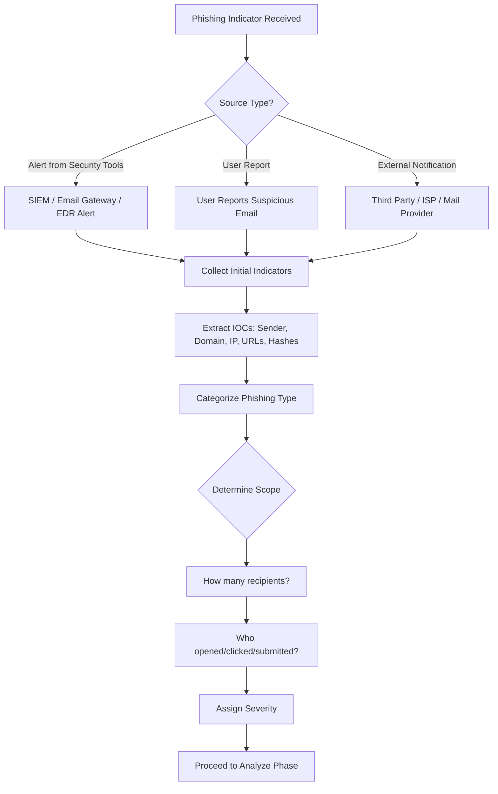
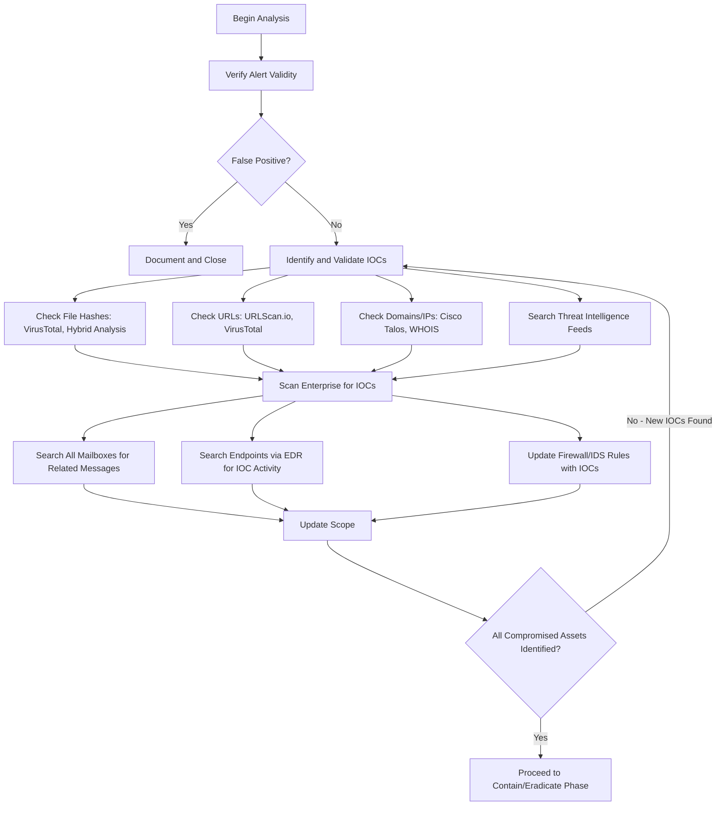
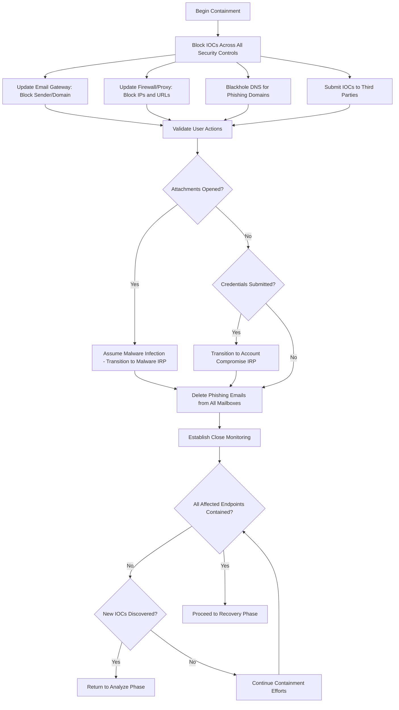
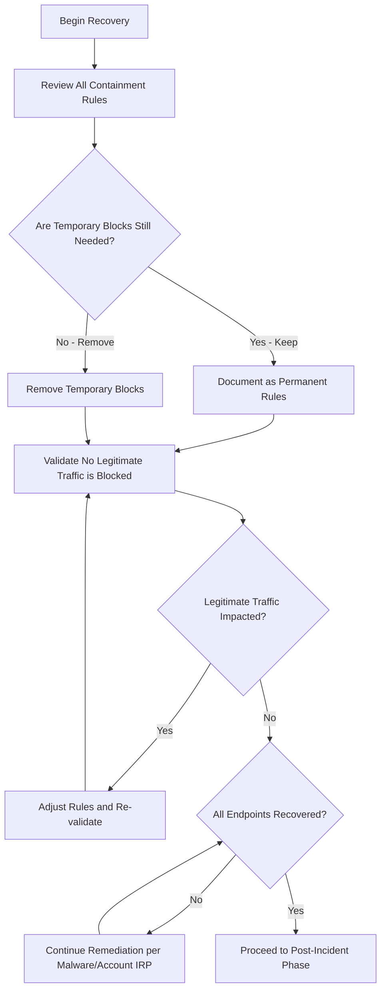
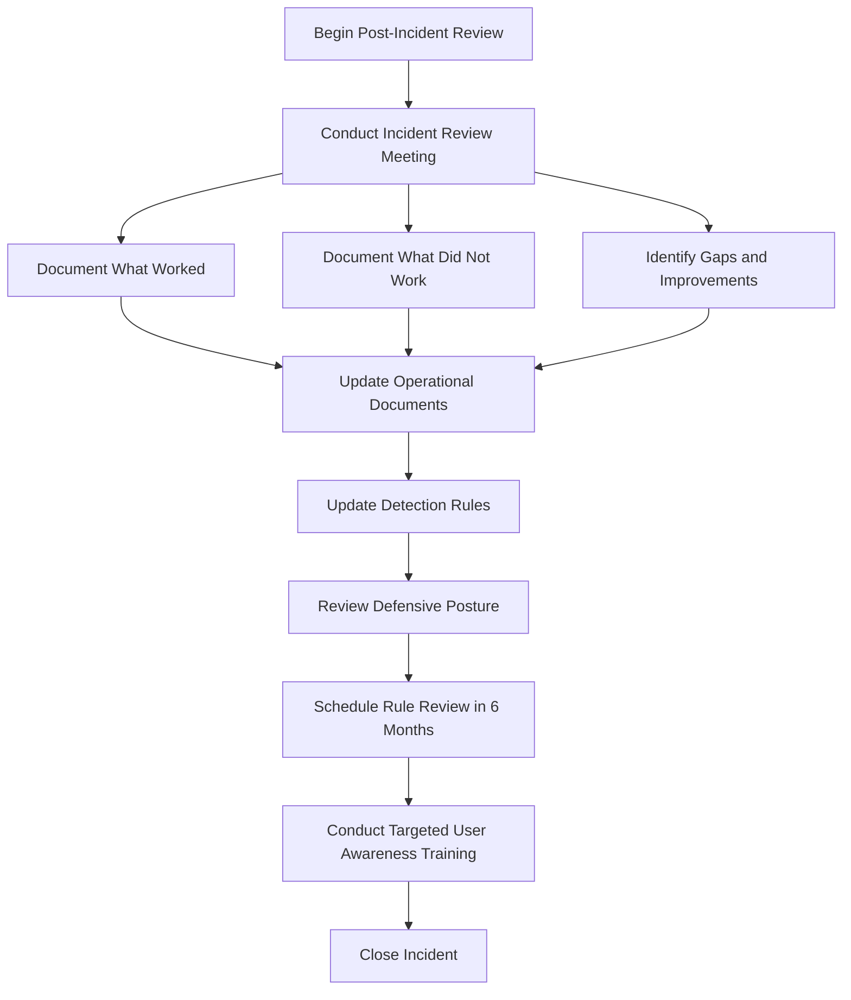

# Phishing Incident Response Playbook

| Field | Details |
|-------|---------|
| **Playbook ID** | IRP-PHISH-001 |
| **Version** | 2.0 |
| **Last Updated** | February 2025 |
| **Incident Category** | Phishing / Email-Based Attacks |
| **MITRE ATT&CK Tactics** | Initial Access (TA0001), Execution (TA0002), Credential Access (TA0006) |
| **Applicable Techniques** | Phishing (T1566), Spearphishing Attachment (T1566.001), Spearphishing Link (T1566.002), Spearphishing via Service (T1566.003) |
| **Severity Range** | Low to Critical (based on triage) |
| **Target Audience** | L2/L3 Analysts, Incident Managers, SOC Leads |
| **Related Playbooks** | [Malware IRP](IRP-Malware.md), [Account Compromise IRP](IRP-AccountCompromised.md), [Data Loss IRP](IRP-DataLoss.md) |

---

## Scope

This playbook covers the end-to-end incident response process for phishing-related incidents, including:

- **Phishing** — Mass campaign emails impersonating brands or services (e.g., Apple, FedEx, Netflix, Microsoft 365)
- **Spear Phishing** — Targeted emails directed at specific individuals or roles within the organization
- **Whaling** — High-profile phishing targeting executives and senior leadership
- **Business Email Compromise (BEC)** — Impersonation of internal executives or vendors to authorize fraudulent transactions
- **Spam with Malicious Intent** — Bulk emails containing malicious links or attachments
- **O365 / Email Forward Rule Abuse** — Attackers creating mailbox forwarding rules to exfiltrate data silently

**Out of Scope:** This playbook does not cover voice phishing (vishing), SMS phishing (smishing), or social engineering conducted through non-email channels. For malware infections resulting from phishing, transition to the [Malware IRP](IRP-Malware.md) after completing the Contain/Eradicate phase. For confirmed credential compromise, transition to the [Account Compromise IRP](IRP-AccountCompromised.md).

---

## 1. Preparation

### 1.1 Organizational Readiness

The following should be established before a phishing incident occurs:

- Maintain an up-to-date inventory of all domains owned by the organization to prevent accidental takedown actions against legitimate company domains.
- Maintain a list of personnel authorized to register domains on behalf of the organization.
- Ensure email security controls are in place, including anti-malware, anti-spam, and anti-phishing solutions at the email gateway level.
- Verify that users know how and where to report suspected phishing emails (e.g., phishing report button, dedicated mailbox, or ticketing system).
- Confirm that detection rules exist for common phishing execution patterns, including Office documents spawning child processes such as PowerShell, CMD, WMI, MSHTA, and scripting engines.

### 1.2 Communication Templates

Prepare the following templates in advance:

- **Internal notification** — Alert all employees about an ongoing phishing campaign targeting the organization.
- **Hosting provider takedown request** — Contact domain registrars or hosting companies to request takedown of phishing domains.
- **Third-party notification** — Inform impersonated brands or services (Microsoft, Google, financial institutions, etc.) that their brand is being used in a phishing campaign.

### 1.3 Tool Access

Ensure the incident response team has access to the following categories of tools:

| Tool Category | Purpose | Examples |
|---------------|---------|----------|
| SIEM Platform | Log search, correlation, and alerting | Splunk, Sentinel, QRadar |
| Email Security Gateway | Email filtering, quarantine, message trace | Proofpoint, Mimecast, Microsoft Defender for Office 365 |
| EDR Platform | Endpoint investigation and containment | CrowdStrike, SentinelOne, Microsoft Defender for Endpoint |
| Threat Intelligence | IOC validation and reputation checks | VirusTotal, Hybrid Analysis, URLScan.io, Cisco Talos |
| URL/Domain Analysis | Safe detonation and analysis of suspicious links | URLScan.io, Any.Run, Joe Sandbox |
| DNS Management | DNS sinkholing and blackholing | Internal DNS infrastructure |

> **Note:** Do not upload files containing sensitive or client data to public analysis platforms such as Hybrid Analysis or Any.Run. Use private/on-premises sandboxes for sensitive content.

### 1.4 Asset and Contact Information

Ensure the following information is accessible (including out-of-hours access):

- Asset inventory covering endpoints, servers, network equipment, and security appliances
- Asset ownership and contact information for both internal business units and customer-facing systems
- Network architecture diagrams and data flow documentation
- Internal escalation paths and contact lists for key teams (IT, Security, Legal, Communications)
- Third-party incident response provider contact details (if retained)

### 1.5 Training and Exercises

- Conduct regular phishing awareness training for all employees, covering how to recognize phishing, the risks of clicking links or opening attachments, and how to report suspicious emails.
- Perform tabletop exercises or fire drills using this playbook at least once per year and after any major revision.
- Review threat intelligence regularly for phishing trends targeting the organization's industry, brands, and known adversaries.

---

## 2. Detection

### 2.1 Workflow

### 2.2 Threat Indicator Sources

Phishing indicators may arrive through multiple channels:

**Internal Alerts:**
- SIEM correlation rules triggering on known phishing patterns
- Email security gateway alerts for blocked or quarantined messages
- EDR alerts for suspicious process execution following email delivery (e.g., Office application spawning PowerShell)
- DNS or web proxy reports showing connections to known phishing domains
- Mail server errors indicating delivery failures to suspicious destinations

**External Notifications:**
- End users reporting suspicious emails through internal reporting mechanisms
- External recipients notifying the organization that phishing emails are being sent from company accounts
- Third-party organizations, ISPs, or email providers reporting abuse
- Threat intelligence feeds identifying new phishing campaigns targeting the sector

### 2.3 Risk Factors

Assess the following risk factors when a phishing indicator is identified:

**Common Risks:**
- Credential theft leading to unauthorized access to internal systems or cloud services
- Malware delivery through attachments or drive-by downloads
- Financial fraud through BEC or invoice manipulation
- Ransomware deployment as a secondary payload

**Organizational Risks:**
- Financial losses from fraudulent transactions, regulatory fines, or contract impacts
- Reputational damage if customer data or communications are compromised
- Regulatory non-compliance if personally identifiable information (PII) is exposed
- Supply chain compromise if partner or vendor accounts are affected

### 2.4 Data Collection

Gather and document the following information as soon as a phishing indicator is identified:

**Email Artifacts:**
- Sender address (display name and actual email address)
- Subject line
- Message body content (copy or screenshot)
- Attachment names, types, and hashes (MD5, SHA256)
- Embedded URLs (fully expanded, not shortened)
- Email headers (full headers including routing information)
- Timestamp of delivery

**Domain and IP Intelligence:**
- Sender domain reputation (check VirusTotal, Cisco Talos)
- Domain registration details (registrar, registration date, owner via WHOIS)
- IP address of sending mail server
- Geolocation of sending IP
- Whether the domain is a lookalike or typosquat of a known brand
- If multi-stage redirects are involved, document the full redirect chain

### 2.5 Categorization

Determine the type of phishing incident:

| Category | Description | Typical Indicators |
|----------|-------------|--------------------|
| **Mass Phishing** | Broad campaign impersonating common brands | Generic greeting, brand spoofing (Apple, FedEx, Netflix), many recipients |
| **Spear Phishing** | Targeted at specific individuals or departments | Personalized content, references to real projects or colleagues |
| **Whaling** | Targeting executives or senior leadership | Impersonation of CEO/CFO, urgent financial requests |
| **BEC** | Business Email Compromise for financial fraud | Compromised or spoofed executive email, wire transfer requests |
| **Credential Phishing** | Designed to steal login credentials | Fake login pages for O365, VPN, internal applications |
| **Malware Delivery** | Attachment or link delivers malicious payload | Office macros, ISO/ZIP attachments, exploit kit links |
| **O365 Forward Rules** | Attacker creates silent email forwarding | Mailbox rules forwarding to external addresses |

### 2.6 Triage and Severity Assessment

Evaluate the scope and impact to assign initial severity:

**Scope Assessment:**
- How many recipients received the phishing email?
- How many users opened the email?
- How many users opened attachments or clicked links?
- How many users submitted credentials or sensitive information?

**Severity Matrix:**

| Severity | Criteria |
|----------|----------|
| **Critical** | Credentials submitted + privileged account affected, or confirmed malware execution on multiple endpoints, or BEC with financial transaction initiated |
| **High** | Credentials submitted by one or more users, or malware attachment opened, or widespread campaign (50+ recipients) |
| **Medium** | Users clicked links but no credential submission confirmed, or attachments downloaded but not executed |
| **Low** | Emails received but no user interaction detected, or emails blocked at the gateway |

---

## 3. Analyze

### 3.1 Workflow

### 3.2 Verification

Before committing resources to full investigation, verify the alert:

- Review the original indicator with a senior SOC analyst to confirm it is not a false positive.
- Cross-reference with known internal communications, marketing campaigns, or legitimate automated emails that may resemble phishing.
- If user-reported, verify the email exists and review it in a safe environment (do not click links or open attachments directly).

### 3.3 IOC Identification and Validation

Systematically validate all indicators of compromise:

**File and Attachment Analysis:**
- Submit file hashes (not files containing sensitive data) to [VirusTotal](https://www.virustotal.com) for reputation checks.
- If the file does not contain sensitive data, submit to [Hybrid Analysis](https://www.hybrid-analysis.com) for behavioral analysis.
- For sensitive files, use an on-premises sandbox or isolated analysis environment.
- Document all hashes (MD5, SHA1, SHA256) for enterprise-wide scanning.

**URL and Link Analysis:**
- Submit URLs to [URLScan.io](https://urlscan.io) for safe rendering and analysis.
- Check URL reputation on [VirusTotal](https://www.virustotal.com).
- Follow redirect chains to identify the final destination (use curl or a sandboxed browser, never a production workstation).
- Check if the URL has been recently registered or is a typosquat of a legitimate domain.

**Domain and IP Analysis:**
- Check domain and IP reputation on [Cisco Talos Intelligence](https://talosintelligence.com).
- Perform WHOIS lookup to identify domain registration date, registrar, and ownership.
- Check if other known malicious domains are hosted on the same IP.
- Determine geolocation and ASN for the sending infrastructure.

**Threat Intelligence Correlation:**
- Search internal threat intelligence platforms for related campaigns or known adversary infrastructure.
- Check if the IOCs match any known threat actor TTPs or active campaigns reported by industry ISACs.

### 3.4 Enterprise-Wide Scanning

Once IOCs are validated, scan the broader environment:

- Search all mailboxes for emails matching the sender address, subject line, attachment hash, or embedded URLs.
- Use EDR to search endpoints for file hashes, process execution, or network connections matching the IOCs.
- Update firewall, IDS/IPS, and proxy rules proactively with newly identified IOCs.
- Check DNS logs for resolutions to phishing domains from internal systems.

### 3.5 Scope Assessment

Update and maintain the following lists throughout the analysis phase:

- Affected recipient email addresses (received, opened, clicked, submitted)
- Affected endpoints (where attachments were opened or links were clicked)
- Affected business units or departments
- Affected customer-facing systems or accounts (if applicable)
- Complete list of IOCs (URLs, domains, IPs, ports, file hashes)

### 3.6 Scope Validation

Before proceeding to containment, confirm that the scope is complete:

- Have all recipient mailboxes been searched?
- Have all endpoints where users interacted with the email been identified?
- Have all IOCs been fully investigated (URLs, domains, IPs, ports, files, hashes)?
- Are there any secondary indicators suggesting a broader campaign?

If new IOCs are discovered during analysis, loop back to Section 3.3 and repeat the validation process. Only proceed to Contain/Eradicate when the scope is fully defined.

---

## 4. Contain and Eradicate

### 4.1 Workflow

### 4.2 Blocking Actions

Implement blocks across all available security controls:

**Email Security:**
- Block the sender address and sender domain at the email gateway.
- Add the sender domain to the blocklist in the anti-spam/anti-phish solution.
- If the phishing email originated from a compromised legitimate account, coordinate with the account owner or their organization before blocking the entire domain.

**Network Security:**
- Add phishing domain IPs to firewall deny rules.
- Block phishing URLs at the web proxy.
- Implement DNS sinkholing for the phishing domains to prevent any further resolution from internal systems.

**Third-Party Reporting:**
- Report the phishing URL to [Google Safe Browsing](https://safebrowsing.google.com/safebrowsing/report_general/).
- Report to the relevant web filter vendor for global categorization.
- If a well-known brand is being impersonated, notify their abuse or security team.
- Report to the domain registrar with a request for takedown.

### 4.3 User Action Validation

Determine exactly what actions affected users took:

- Did users read the email without further interaction?
- Did users open attachments? If so, which file types, and was macro execution enabled?
- Did users click links? If so, what page did they reach, and did they interact with it?
- Did users submit credentials or personal information on a phishing page?
- Did users reply to the email or forward it to others?

### 4.4 Malware Infection Assessment

If malicious attachments were opened or malware-hosting links were visited:

- Assume the endpoint is compromised until proven otherwise.
- Transition to the [Malware IRP](IRP-Malware.md) for endpoint containment and remediation.
- Isolate affected endpoints immediately using EDR network isolation or by removing them from the network.
- Preserve forensic evidence before any remediation.

### 4.5 Credential Compromise Assessment

If users submitted credentials on a phishing page:

- Transition to the [Account Compromise IRP](IRP-AccountCompromised.md).
- Immediately reset passwords for all affected accounts.
- Revoke active sessions and tokens.
- Check for unauthorized mailbox rules, MFA changes, or OAuth application grants.
- Review login history for signs of unauthorized access.

### 4.6 Email Removal

Remove the phishing email from the environment:

- Delete the email from all recipient inboxes using the email security gateway's search-and-purge functionality or the email admin console.
- Check and purge from both cloud and on-premises mailboxes if applicable.
- Remove any downloaded attachments from endpoints using EDR.
- Verify deletion was successful by re-searching for the email across all mailboxes.

### 4.7 Close Monitoring

Establish monitoring for the duration of the incident:

- Monitor for related incoming emails (same sender, similar subject, same domain).
- Monitor for outbound network connections to the identified IOCs (domains, IPs).
- Monitor for new files matching the identified hashes appearing on any endpoint.
- Set SIEM alerts for any activity from affected user accounts that may indicate further compromise.

### 4.8 Containment Validation

Before proceeding to recovery:

- Confirm all affected endpoints have been contained or isolated.
- Confirm all phishing emails have been removed from all mailboxes.
- Confirm all IOCs are blocked across security controls.
- If new IOCs are discovered during containment, return to the [Analyze Phase](#3-analyze) to re-assess scope.

---

## 5. Recovery

### 5.1 Workflow

### 5.2 Defense Updates

Review all containment rules and determine their long-term status:

**Rules to Evaluate:**
- Email gateway sender and domain blocks
- Spam filter rules added during the incident
- Firewall deny rules for phishing IPs
- Web proxy URL blocks
- DNS sinkhole entries
- EDR hash bans, domain blocks, and endpoint isolation policies

For each rule, decide whether it should be made permanent, kept temporarily with a review date, or removed. Document the decision and rationale.

### 5.3 Recovery Validation

Verify that containment and eradication actions have not impacted legitimate business operations:

- Confirm that no legitimate emails are being blocked by new spam filter or gateway rules.
- Confirm that no legitimate websites or services are blocked by new proxy or firewall rules.
- Confirm that no legitimate applications are blocked by new EDR rules.
- If legitimate traffic is impacted, adjust the rules and re-validate.

### 5.4 Endpoint and Account Recovery

- For endpoints that were isolated or remediated under the Malware IRP, confirm they have been fully restored and returned to service.
- For accounts that were reset under the Account Compromise IRP, confirm users have regained access and no unauthorized changes remain.
- Verify that no malicious mailbox forwarding rules, OAuth grants, or MFA changes persist.

---

## 6. Post-Incident

### 6.1 Workflow

### 6.2 Incident Review

Conduct a post-incident review meeting with all involved parties. Document:

- **What worked well** — Which detection mechanisms caught the phishing email? How quickly was the team able to respond? Were the right tools and access available?
- **What did not work** — Were there delays in detection, analysis, or containment? Did any security controls fail to catch the email? Were there gaps in communication or escalation?
- **Improvement opportunities** — What specific changes to tools, processes, or training would improve the response next time?

### 6.3 Documentation Updates

Update the following documents based on lessons learned:

- Security policies (if policy gaps were identified)
- Incident response procedures and this playbook
- SOC runbooks and standard operating procedures
- Escalation paths and contact lists

### 6.4 Detection Rule Updates

Review and update detection rules across:

- SIEM — Add new correlation rules or update existing ones based on the attack pattern observed.
- Email security gateway — Update filtering rules, sender reputation lists, and anti-phish policies.
- EDR — Add behavioral detection rules for the execution patterns observed.
- Web proxy — Update URL categorization or custom block lists.
- IDS/IPS — Add signatures for observed network-level indicators.

### 6.5 Defensive Posture Review

- Schedule a review of all rules introduced during this incident in 6 months to determine if they are still applicable.
- Evaluate whether existing controls adequately address the attack vector used. If not, identify and prioritize new controls.
- Assess whether the current rules remain effective:
  - Spam filter rules
  - Firewall rules for phishing infrastructure
  - Proxy rules for C2 domains
  - EDR custom signatures and behavioral rules
  - IPS signatures

### 6.6 User Awareness Training

If users interacted with the phishing email (clicked, opened, submitted), provide targeted training covering:

- How to recognize phishing emails (sender spoofing, urgency language, suspicious links, unexpected attachments)
- How to report suspected phishing using the organization's reporting mechanism
- The risks of clicking links in unsolicited emails
- The risks of opening attachments from unknown or unexpected senders
- The risks of entering credentials on pages reached through email links
- How BEC and social engineering attacks work

For organization-wide campaigns, consider sending a company-wide awareness communication about the incident (without disclosing sensitive details) to reinforce vigilance.

---

## References

This playbook was developed using the following frameworks and resources:

- [NIST SP 800-61 Rev. 2 — Computer Security Incident Handling Guide](https://nvlpubs.nist.gov/nistpubs/SpecialPublications/NIST.SP.800-61r2.pdf)
- [CERT Société Générale — Incident Response Methodologies](https://github.com/certsocietegenerale/IRM/tree/master/EN)
- [IncidentResponse.com — Phishing Playbook](https://www.incidentresponse.com/playbooks/)
- [Scottish Government — Cyber Resilience Incident Management](https://www.gov.scot/publications/cyber-resilience-incident-management/)
- [MITRE ATT&CK — Phishing (T1566)](https://attack.mitre.org/techniques/T1566/)
