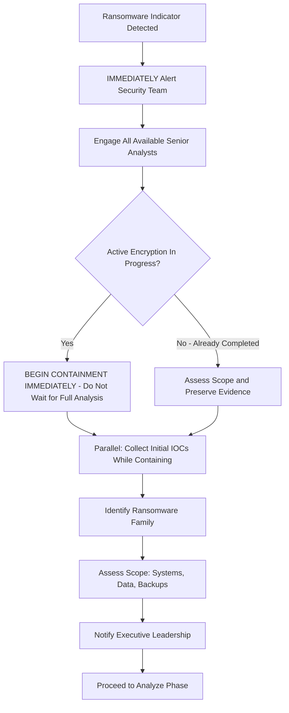
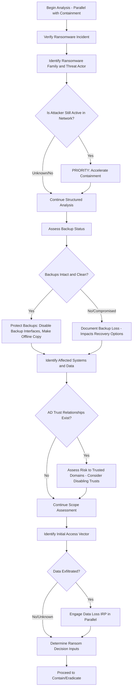
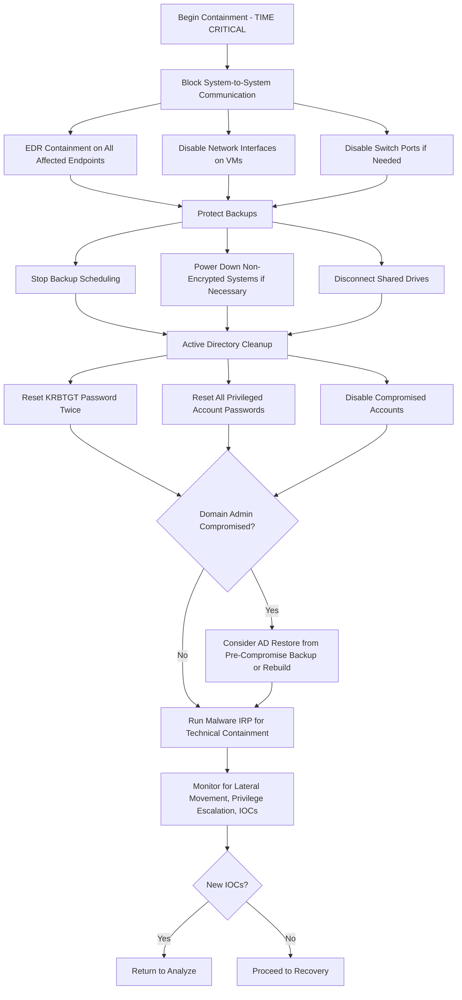
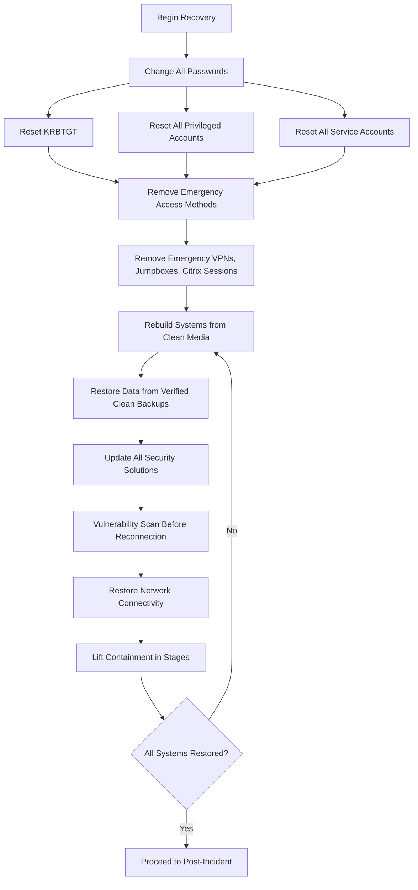

# Ransomware Incident Response Playbook

| Field | Details |
|-------|---------|
| **Playbook ID** | IRP-RANSOM-001 |
| **Version** | 2.0 |
| **Last Updated** | February 2025 |
| **Incident Category** | Ransomware / Extortion |
| **MITRE ATT&CK Tactics** | Impact (TA0040), Execution (TA0002), Lateral Movement (TA0008), Exfiltration (TA0010) |
| **Applicable Techniques** | Data Encrypted for Impact (T1486), Inhibit System Recovery (T1490), Data Destruction (T1485), Remote Services (T1021) |
| **Severity Range** | High to Critical (always treated as high priority) |
| **Target Audience** | L2/L3 Analysts, Incident Managers, SOC Leads, Executive Leadership |
| **Related Playbooks** | [Malware IRP](IRP-Malware.md), [Account Compromise IRP](IRP-AccountCompromised.md), [Data Loss IRP](IRP-DataLoss.md) |

---

## Scope

This playbook covers the end-to-end incident response process for ransomware and extortion incidents, including:

- **Ransomware Encryption** — Malware that encrypts files and demands payment for decryption keys
- **Double Extortion** — Ransomware combined with data exfiltration and threat of public disclosure
- **DDoS Extortion** — Ransom demands backed by distributed denial-of-service attacks
- **Data Extortion Without Encryption** — Threat actors steal data and demand payment without deploying ransomware
- **Wiper Disguised as Ransomware** — Destructive malware masquerading as ransomware with no intent to decrypt

**Critical Note:** Ransomware incidents are TIME-SENSITIVE. Every minute of delay increases the scope of encryption and the potential for lateral movement. This playbook is designed to run in parallel with the [Malware IRP](IRP-Malware.md) for technical malware analysis and containment. If the attacker is still active in the network, containment actions must be interleaved with analysis — do not wait for analysis to complete before beginning containment.

**Out of Scope:** Standard malware infections without encryption or extortion components (see [Malware IRP](IRP-Malware.md)). Data loss resulting from ransomware should also engage the [Data Loss IRP](IRP-DataLoss.md) in parallel.

---

## 1. Preparation

### 1.1 Organizational Readiness

- Maintain and regularly test offline backup systems. Verify that backups cannot be accessed or encrypted by ransomware (air-gapped or immutable storage).
- Document the organization's Active Directory architecture including all trust relationships between domains and forests.
- Establish a pre-authorized process for emergency network isolation (disconnecting segments, disabling trusts, shutting down MPLS links) — these decisions must be made in minutes, not hours.
- Identify and document all critical systems and their recovery priority order.
- Retain a third-party incident response firm with ransomware expertise (pre-negotiated retainer recommended).
- Establish a relationship with law enforcement (FBI, local cyber crime unit) for ransomware reporting.
- Maintain offline copies of this playbook and critical documentation — during ransomware incidents, internal systems may be unavailable.
- Consider cyber insurance coverage that includes ransomware negotiation and payment services.

### 1.2 Communication Templates

- **Internal emergency notification** — Immediate all-hands alert for the security team and IT leadership. Include instructions to NOT restart systems or attempt self-remediation.
- **Executive briefing** — Template for briefing C-level leadership on scope, impact, and decision points (including ransom payment considerations).
- **Employee notification** — Inform all staff about the incident with clear instructions (do not connect to the network, do not attempt to decrypt files, do not communicate with the attacker).
- **Client notification** — Inform affected clients about service disruption and data exposure risk.
- **Regulatory notification** — Template for mandatory breach notifications (GDPR 72-hour requirement, HIPAA, state breach notification laws).
- **Media statement** — Prepared holding statement for public communications.

### 1.3 Tool Access

| Tool Category | Purpose | Examples |
|---------------|---------|----------|
| SIEM Platform | Log analysis, lateral movement detection | Splunk, Sentinel, QRadar |
| EDR Platform | Endpoint containment, process investigation | CrowdStrike, SentinelOne, Defender for Endpoint |
| Backup Systems | Backup verification, restoration | Veeam, Commvault, Azure Backup |
| Ransomware ID | Identify ransomware family | ID Ransomware (id-ransomware.malwarehunterteam.com), No More Ransom |
| Active Directory | Account management, trust review | AD Users & Computers, PowerShell AD module |
| Network Infrastructure | Segmentation, isolation | Firewalls, switches, VLAN management |
| Forensic Tools | Evidence preservation | KAPE, FTK Imager, Volatility |

### 1.4 Asset and Contact Information

- Critical system inventory with recovery priority ranking
- Backup system documentation: locations, schedules, retention, and offline/immutable status
- Active Directory architecture including all trusts and forest relationships
- Executive leadership contact list (including personal phones for out-of-hours notification)
- Cyber insurance provider contact and policy details
- Third-party IR firm contact details (retainer number, emergency line)
- Law enforcement contact information

### 1.5 Training and Exercises

- Conduct ransomware-specific tabletop exercises at least annually, involving security, IT, legal, communications, and executive leadership.
- Test backup restoration procedures quarterly — actually restore systems, do not just verify backups exist.
- Train IT staff on emergency isolation procedures (network segmentation, AD trust removal, MPLS disconnection).
- Review threat intelligence for active ransomware groups, their TTPs, and recently exploited vulnerabilities.

---

## 2. Detection

### 2.1 Workflow

### 2.2 Threat Indicator Sources

**Internal Alerts:**
- EDR/AV alerts for known ransomware signatures or behaviors (mass file renaming, encryption patterns)
- SIEM alerts for rapid file modification across multiple systems
- Monitoring alerts for disabled shadow copies or backup service disruption
- Network alerts for lateral movement tools (PsExec, WMI, RDP brute force)
- Alert on known ransomware file extensions appearing on file shares

**User Reports:**
- Users unable to access files (files encrypted or renamed with unfamiliar extensions)
- Ransom note displayed on screen or found as text/HTML file in directories
- Systems unusually slow or unresponsive (active encryption consumes resources)
- Printers printing ransom notes (some ransomware families do this)

**External Notifications:**
- Threat intelligence indicating active ransomware campaign targeting the sector
- Notification from partner or client of ransomware spread from company infrastructure
- Darkweb monitoring detecting company data on extortion leak sites

### 2.3 Risk Factors

**Immediate Risks:**
- Total business disruption if critical systems are encrypted
- Data loss if backups are also encrypted or compromised
- Data exposure if attackers exfiltrate before encrypting (double extortion)
- Lateral spread to additional systems, domains, and connected partner networks

**Organizational Risks:**
- Significant financial impact from ransom payment, recovery costs, and business interruption
- Regulatory penalties and mandatory breach notifications
- Reputational damage and loss of customer trust
- Potential insolvency for organizations without adequate insurance or recovery capabilities

### 2.4 Data Collection (Rapid — Do Not Delay Containment)

**Immediate Information:**
- Ransom note content (screenshot or copy — do NOT interact with attacker portals yet)
- Encrypted file extensions
- Known affected systems (initial list — will expand during analysis)
- Malware sample if available (file hash at minimum)
- Timestamps of first observed encryption activity

**Ransomware Identification:**
- Upload encrypted file sample and ransom note to [ID Ransomware](https://id-ransomware.malwarehunterteam.com) to identify the family.
- Check [No More Ransom](https://www.nomoreransom.org) for available free decryptors.
- Identify the threat actor group and research their known TTPs, typical demands, and reliability of decryption after payment.

### 2.5 Severity Assessment

Ransomware incidents are **always High or Critical**:

| Severity | Criteria |
|----------|----------|
| **Critical** | Active encryption in progress, domain controller compromised, backups affected, data exfiltration confirmed, multiple business units impacted |
| **High** | Encryption completed on limited scope, backups intact, no evidence of data exfiltration, single business unit affected |

---

## 3. Analyze

### 3.1 Workflow

### 3.2 Active Attacker Assessment

Determine if the threat actor is still present in the network:

- Are new systems being encrypted in real-time?
- Is there active lateral movement (new RDP sessions, PsExec usage, WMI commands)?
- Are security tools being disabled or tampered with?
- If the attacker is still active, containment must happen IMMEDIATELY — interleave with analysis.

### 3.3 Backup Assessment

This is a critical recovery decision point:

- Are backups intact and not encrypted?
- When was the last successful backup before the infection?
- Are backups stored offline or on immutable storage?
- Can backups be accessed without the compromised infrastructure?

**Immediate Backup Protection Actions:**
- Disable all backup scheduling to prevent overwriting clean backups with encrypted data.
- Disable backup network interfaces to prevent ransomware from reaching backup storage.
- Make an offline copy of the most recent clean backup immediately.
- Verify backup integrity by test-restoring a sample of critical data.

### 3.4 Ransomware Family and Threat Actor Identification

Using available artifacts, identify the adversary:

- Ransom note content and formatting (often unique to specific groups)
- Encrypted file extension patterns
- Malware payload analysis (hash, behavior, C2 infrastructure)
- Email addresses or web portal URLs provided for contact
- Bitcoin or cryptocurrency wallet addresses
- Known TTPs: lateral movement method (PsExec, WMI, RDP), initial access technique, privilege escalation approach

Understanding the threat actor helps predict: whether they reliably provide decryptors after payment, their typical ransom demand range, their operational patterns, and whether a free decryptor exists.

### 3.5 Affected Systems Assessment

Document all affected and at-risk systems:

- Servers (OS version, role, applications hosted)
- Workstations and endpoints
- Databases and data stores
- File shares and SAN/NAS systems
- Backup infrastructure
- Active Directory domain controllers
- Cloud infrastructure and services

### 3.6 AD Trust Assessment

If the compromised environment has trust relationships with other domains:

- Identify all trust relationships (one-way and two-way).
- Assess the risk of ransomware spreading through trusts.
- Consider disabling trusts as a preventive measure (requires management approval).
- In extreme cases, disconnecting MPLS links may be necessary (requires executive approval).

### 3.7 Data Exfiltration Assessment

Modern ransomware groups commonly exfiltrate data before encryption:

- Review firewall and proxy logs for large outbound data transfers in the days/weeks before encryption.
- Check for staging activity (data compression, archiving to temp directories).
- Monitor the threat actor's leak site for company data.
- If data exfiltration is confirmed, engage the [Data Loss IRP](IRP-DataLoss.md) in parallel.

### 3.8 Ransom Payment Considerations

**This decision must be made by executive leadership (or the client), not the SOC team.** The SOC's role is to provide factual information to support the decision:

- What is the scope of encrypted data and is it recoverable from backups?
- Is a free decryptor available for this ransomware family?
- What is the threat actor's reputation for providing working decryptors?
- What is the estimated cost of recovery without paying versus paying?
- Will cyber insurance cover the ransom and/or recovery costs?
- Are there legal restrictions on payment (OFAC sanctions on certain ransomware groups)?
- Ransomware groups are typically open to negotiation — the initial demand is rarely the final price.

### 3.9 Root Cause Identification

Identify the initial access vector to prevent reinfection during recovery:

- Phishing email with malicious attachment or link
- Exploitation of public-facing vulnerability (VPN, RDP, web application)
- Compromised remote access (weak/default passwords, brute force)
- Supply chain compromise
- Insider threat
- Lost or stolen device

### 3.10 Communication

Contact relevant parties:

- Internal security team and IT leadership
- Executive leadership and legal counsel
- Affected clients (if client data is impacted)
- Law enforcement (recommended for all ransomware incidents)
- Cyber insurance provider
- Third-party IR firm (if engagement is needed)

---

## 4. Contain and Eradicate

### 4.1 Workflow

### 4.2 Immediate Network Isolation

The first priority is stopping the spread. Use all available methods:

- **EDR containment** — Isolate all affected endpoints via EDR console.
- **Local/EDR firewall** — Block all system-to-system communication (note: attackers on the system may circumvent local firewall rules).
- **Network interface shutdown** — Disable virtual NICs on VMs.
- **Switch port disablement** — Disable ports on the switch for physical endpoints.
- **Network segmentation** — Isolate affected network segments at the firewall level.

**Do NOT power off encrypted systems** — they may not restart, and volatile memory contains forensic evidence. **Do consider powering down non-encrypted systems** to prevent them from being encrypted.

### 4.3 Backup Protection

- Stop all backup scheduling immediately.
- Verify snapshot status and protect clean snapshots.
- Disconnect backup storage from the network.
- Make offline copies of clean backups.

### 4.4 Shared Drive Protection

- Disconnect all shared drives and network file shares immediately.
- Disable SMB access at the network level if possible.
- This prevents ransomware from encrypting shared data stores.

### 4.5 Active Directory Cleanup

In most ransomware scenarios:

- Reset the KRBTGT password twice (minimum 10-hour gap for replication between resets).
- Reset ALL privileged account passwords (Domain Admins, Enterprise Admins, Schema Admins).
- Disable any accounts known to be compromised.

If Domain Admin accounts are confirmed compromised:

- Restore Active Directory from a backup that predates the initial compromise.
- If no clean AD backup exists, consider rebuilding the AD from scratch (requires executive approval).
- These actions should be performed BEFORE the KRBTGT and privilege account resets.

### 4.6 Malware Technical Containment

Run the [Malware IRP](IRP-Malware.md) in parallel for:

- C2 infrastructure blocking (firewall, DNS sinkhole, proxy)
- Malware artifact identification and documentation
- Enterprise-wide scanning for malware presence
- Vendor signature requests

### 4.7 Close Monitoring

Maintain heightened monitoring for:

- Lateral movement attempts from contained systems
- Privilege escalation activities
- New IOC activity anywhere in the environment
- Attempts to re-establish C2 communication
- Any encryption activity on previously unaffected systems

---

## 5. Recovery

### 5.1 Workflow

### 5.2 Credential Reset (Comprehensive)

Before reconnecting any systems:

- Reset KRBTGT password (if not already done during containment).
- Reset ALL privileged account passwords.
- Reset all service account passwords and update in dependent applications.
- Force password change for all domain users at next login.

### 5.3 Remove Emergency Access

Remove any emergency access methods established during the incident:

- Emergency VPN connections
- Temporary jumpbox systems
- Emergency Citrix or remote access sessions
- Any temporary firewall rules granting emergency access

### 5.4 System Rebuild

- Install operating systems from clean media — do NOT restore from pre-infection images that may contain dormant malware.
- Evaluate whether OS versions can be upgraded during rebuild.
- Install current patches before reconnecting to the network.
- Install and verify EDR/AV with current signatures.
- Restore DATA ONLY from verified clean backups (do not restore executables, scripts, or configurations from backup).

### 5.5 Defense Updates

- Update AV/EDR engines, policies, and definitions across the environment.
- Update firewall rules to reflect permanent blocks.
- Reconnect shared drives only after verification.
- Re-enable backup links to verified clean backup infrastructure.
- Re-enable network interfaces on rebuilt systems.

### 5.6 Staged Restoration

Restore systems in priority order:

- Critical infrastructure first (AD, DNS, DHCP, core networking)
- Business-critical applications
- End-user systems
- Non-critical systems

Monitor each stage for signs of re-infection before proceeding to the next.

---

## 6. Post-Incident

### 6.1 Incident Review

Document comprehensively:

- Timeline from initial compromise to detection to full recovery
- What worked and what did not in each phase
- Decisions made and their outcomes (especially ransom payment decision)
- Total incident duration and business impact

### 6.2 Documentation Updates

Update policies, procedures, playbooks, and runbooks based on lessons learned. Update detection rules in SIEM, EDR, email gateway, and all security solutions.

### 6.3 Defense Upgrades

- Update AV signatures and engines across ALL vendors and ALL environments.
- Create EDR behavioral rules for the observed ransomware TTPs.
- Update email security, anti-spam, and anti-phishing rules.
- Consider deploying additional controls: network detection, deception technologies, privileged access management.

### 6.4 New Detection Development

If the ransomware was detected late in the kill chain, build earlier-stage detections:

- SIEM rules for initial access and lateral movement patterns
- Alerts for shadow copy deletion or backup service disruption
- Alerts for mass file renaming or encryption patterns
- Behavioral detection for common ransomware precursor tools (Cobalt Strike, Mimikatz, BloodHound)

### 6.5 Infrastructure Hardening

- Review and harden base images with current patches.
- Implement or strengthen network segmentation.
- Review and restrict RDP, SMB, and other remote access protocols.
- Implement privileged access workstations (PAWs) for AD administration.
- Evaluate and implement immutable backup solutions.
- Consider disabling macros in Office documents by default.

### 6.6 User Awareness Training

If caused by user action (phishing, credential compromise):

- Targeted training for affected users.
- Organization-wide training on the attack vector used.
- Use the sanitized incident as a real-world training example.

### 6.7 Incident Cost Calculation

Document total cost:

- Staff hours (internal and external consultants)
- Ransom payment (if made)
- Business downtime and revenue loss
- Hardware/software replacement and rebuild costs
- Regulatory fines and legal costs
- Cyber insurance deductible and impact on premiums
- Customer churn and reputational impact

---

## References

- [NIST SP 800-61 Rev. 2 — Computer Security Incident Handling Guide](https://nvlpubs.nist.gov/nistpubs/SpecialPublications/NIST.SP.800-61r2.pdf)
- [CISA — Ransomware Guide](https://www.cisa.gov/stopransomware)
- [CERT Société Générale — Incident Response Methodologies](https://github.com/certsocietegenerale/IRM/tree/master/EN)
- [No More Ransom Project](https://www.nomoreransom.org)
- [ID Ransomware](https://id-ransomware.malwarehunterteam.com)
- [MITRE ATT&CK — Data Encrypted for Impact (T1486)](https://attack.mitre.org/techniques/T1486/)
